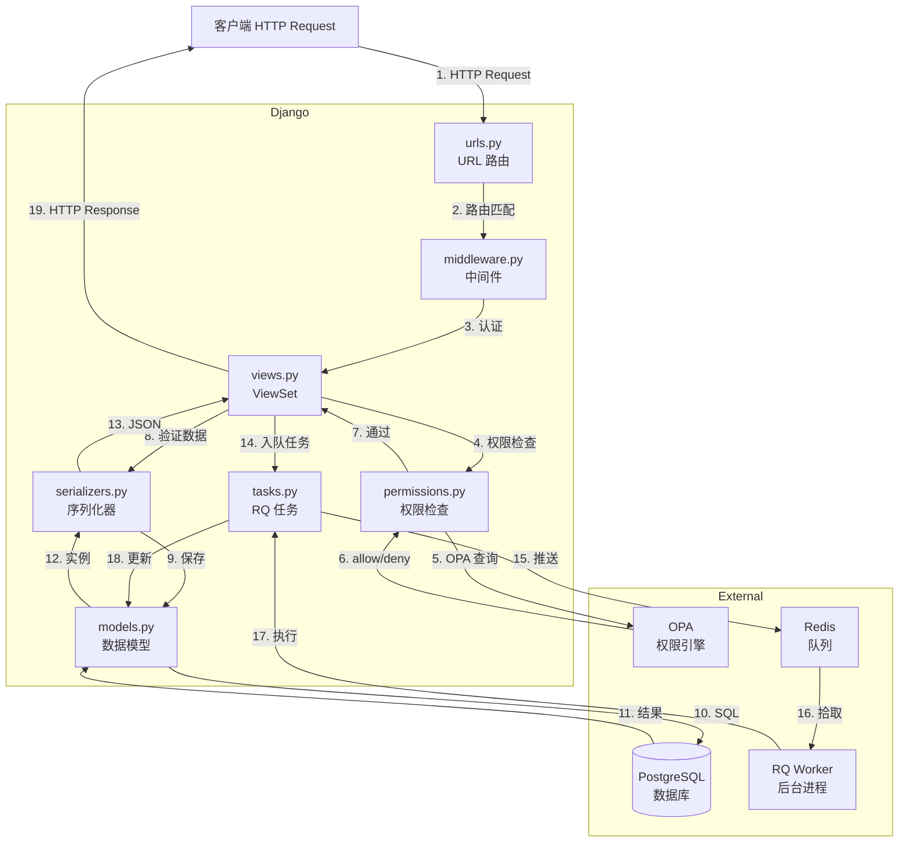
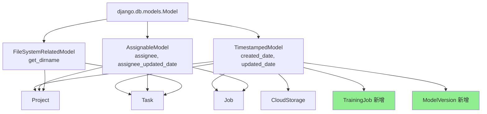
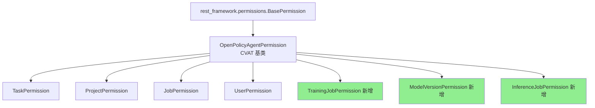
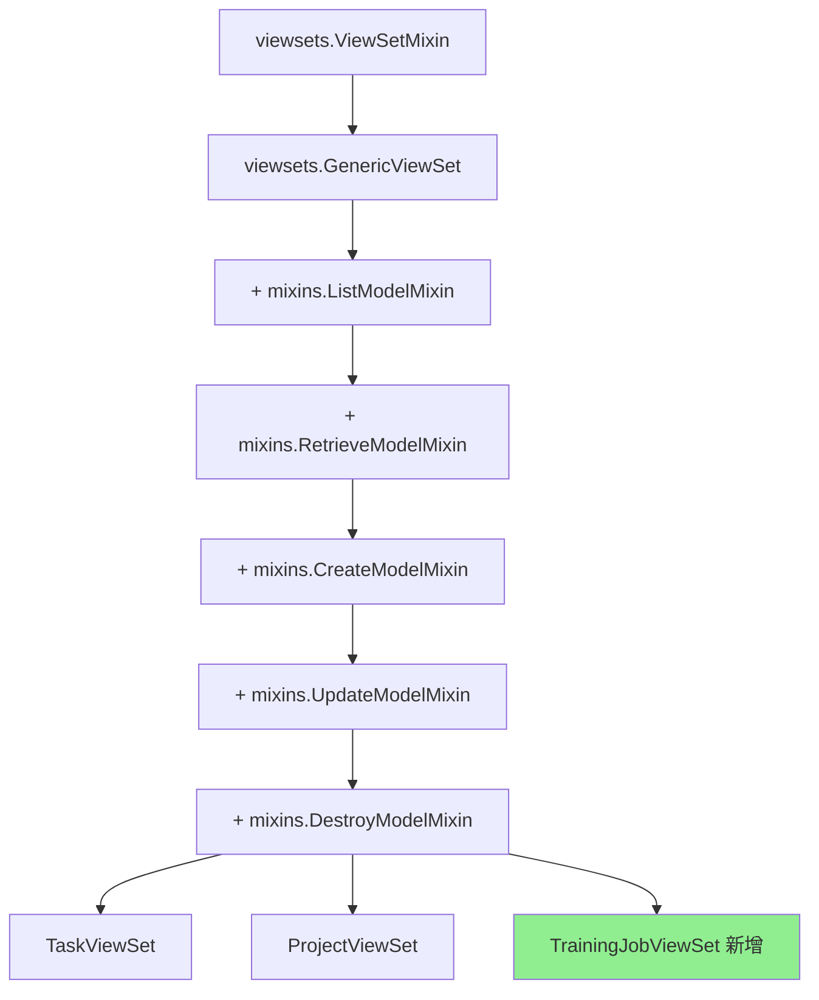
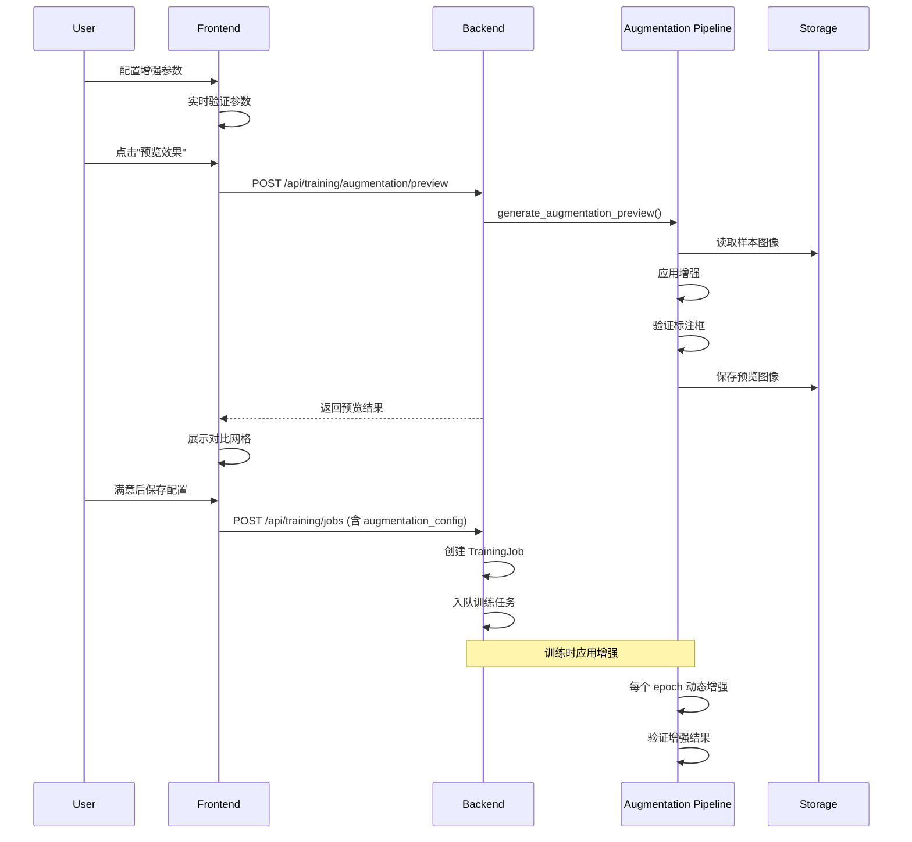

# CVAT 项目文件夹结构详解

## 📁 根目录结构

```
cvat-develop/
├── ai-models/              # AI 模型部署配置和函数代码
├── backend_entrypoint.d/   # 后端启动脚本配置
├── changelog.d/            # 变更日志片段 (scriv 格式)
├── components/             # 基础设施组件配置
├── cvat/                   # Django 后端核心代码
├── cvat-canvas/            # Canvas 标注画布库 (TypeScript)
├── cvat-cli/               # 命令行工具
├── cvat-core/              # 核心 API 客户端库 (TypeScript)
├── cvat-data/              # 数据处理工具
├── cvat-sdk/               # Python SDK
├── cvat-ui/                # React 前端代码
├── dev/                    # 开发工具和脚本
├── helm-chart/             # Kubernetes Helm 部署配置
├── site/                   # 文档网站 (MkDocs)
├── supervisord/            # Supervisord 配置
├── tests/                  # 端到端测试
├── utils/                  # 通用工具库
├── docker-compose.yml      # Docker Compose 配置
├── docker-compose.dev.yml  # 开发环境配置
└── Dockerfile              # Docker 镜像构建文件
```

---

## 🔥 核心目录详解

### 1. `cvat/` - Django 后端核心

```
cvat/
├── apps/                   # Django 应用模块 (核心业务逻辑)
├── requirements/           # Python 依赖管理
├── settings/               # Django 配置文件
├── utils/                  # 后端工具函数
├── __init__.py             # 版本号定义
├── asgi.py                 # ASGI 入口 (异步服务器)
├── nginx.conf              # Nginx 配置模板
├── rq_patching.py          # RQ 队列补丁
├── rqworker.py             # RQ Worker 启动脚本
├── schema.yml              # OpenAPI 规范文件
└── urls.py                 # 根路由配置
```

#### **作用说明:**
- **Django 项目根目录**,包含所有后端代码
- `urls.py` 是整个 API 的入口路由
- `settings/` 包含不同环境的配置 (开发/生产/测试)
- `apps/` 是核心业务逻辑所在地

---

### 2. `cvat/apps/` - Django 应用模块

```
cvat/apps/
├── access_tokens/          # API 访问令牌管理
├── consensus/              # 共识标注 (多人标注一致性)
├── dataset_manager/        # 🔥 数据集导入/导出管理
├── dataset_repo/           # 数据集仓库
├── engine/                 # 🔥🔥🔥 核心引擎 (Task/Job/Project)
├── events/                 # 事件日志系统
├── health/                 # 健康检查
├── iam/                    # 🔥 身份认证和授权 (IAM)
├── lambda_manager/         # 🔥 Nuclio 函数管理 (AI 模型部署)
├── log_viewer/             # 日志查看器
├── organizations/          # 🔥 组织/团队管理
├── quality_control/        # 质量控制和评估
├── redis_handler/          # Redis 任务状态处理
├── webhooks/               # Webhook 事件通知
└── profiler.py             # 性能分析工具
```

#### **每个 App 的作用:**

| App 名称 | 作用 | 关键模型 |
|---------|------|---------|
| **engine** | 🔥 核心业务逻辑 | Task, Job, Project, Data, Label, Annotation |
| **iam** | 身份认证和权限管理 | User, Permission, Role |
| **organizations** | 多租户组织管理 | Organization, Membership, Invitation |
| **dataset_manager** | 数据集格式转换 | 无模型,纯功能模块 |
| **lambda_manager** | AI 模型部署到 Nuclio | LambdaFunction, LambdaRequest |
| **webhooks** | 事件通知机制 | Webhook, WebhookDelivery |
| **quality_control** | 标注质量评估 | QualityReport, QualitySettings |
| **consensus** | 多人标注一致性 | ConsensusReport, ConsensusSettings |
| **events** | 用户行为日志 | Event (存储在 ClickHouse) |
| **access_tokens** | API Token 管理 | AccessToken |
| **redis_handler** | RQ 任务状态查询 | 无模型,纯 API |
| **health** | 系统健康检查 | 无模型,纯 API |

---

### 3. `cvat/apps/engine/` - 核心引擎详解

```
cvat/apps/engine/
├── assets/                 # 静态资源 (预览图等)
├── management/             # Django 管理命令
│   └── commands/           # 自定义命令 (如数据迁移)
├── migrations/             # 🔥 数据库迁移文件
├── redis_migrations/       # Redis 数据迁移
├── rules/                  # 🔥 OPA 权限规则 (Rego 语言)
│   ├── tasks.rego          # Task 权限规则
│   ├── projects.rego       # Project 权限规则
│   ├── jobs.rego           # Job 权限规则
│   └── ...
├── static/                 # 静态文件 (logo 等)
├── tests/                  # 🔥 单元测试和集成测试
│   ├── test_rest_api.py    # REST API 测试
│   └── test_rest_api_3D.py # 3D 标注测试
├── __init__.py
├── admin.py                # Django Admin 配置
├── apps.py                 # App 配置
├── background.py           # 🔥 后台任务 (RQ Job 定义)
├── backup.py               # 备份/恢复功能
├── cache.py                # 🔥 媒体缓存管理
├── cloud_provider.py       # 🔥 云存储集成 (S3/Azure/GCS)
├── exceptions.py           # 自定义异常
├── filters.py              # DRF 过滤器
├── frame_provider.py       # 🔥 帧数据提供者 (视频/图像)
├── handlers.py             # 信号处理器
├── middleware.py           # Django 中间件
├── mixins.py               # ViewSet Mixin
├── models.py               # 🔥🔥🔥 核心数据模型定义
├── pagination.py           # 分页配置
├── permissions.py          # 🔥 权限类定义
├── renderers.py            # 响应渲染器
├── rq.py                   # RQ 队列工具
├── serializers.py          # 🔥🔥 DRF 序列化器
├── signals.py              # Django 信号
├── task.py                 # Task 业务逻辑
├── tus.py                  # TUS 文件上传协议
├── urls.py                 # 🔥 URL 路由
├── utils.py                # 工具函数
├── view_utils.py           # View 辅助函数
└── views.py                # 🔥🔥🔥 ViewSet 定义 (API 端点)
```

#### **关键文件说明:**

| 文件 | 作用 | 重要性 |
|-----|------|--------|
| **models.py** | 定义所有数据库模型 (Task, Job, Project, Data, Label 等) | ⭐⭐⭐⭐⭐ |
| **views.py** | 定义所有 API 端点 (ViewSet) | ⭐⭐⭐⭐⭐ |
| **serializers.py** | 定义请求/响应序列化器 | ⭐⭐⭐⭐⭐ |
| **permissions.py** | 定义权限检查逻辑 | ⭐⭐⭐⭐ |
| **background.py** | 定义异步任务 (训练/推理需要参考) | ⭐⭐⭐⭐ |
| **cache.py** | 媒体缓存管理 (视频帧缓存) | ⭐⭐⭐ |
| **cloud_provider.py** | 云存储抽象层 | ⭐⭐⭐ |
| **rules/*.rego** | OPA 权限规则 (需要为新 App 添加) | ⭐⭐⭐⭐ |
| **migrations/** | 数据库迁移历史 | ⭐⭐⭐ |

---

### 4. `cvat/settings/` - Django 配置

```
cvat/settings/
├── __init__.py             # 自动选择配置文件
├── base.py                 # 🔥🔥🔥 基础配置 (所有环境共享)
├── development.py          # 开发环境配置
├── production.py           # 生产环境配置
├── testing.py              # 测试环境配置
├── testing_rest.py         # REST API 测试配置
└── email_settings.py       # 邮件配置
```

#### **base.py 包含:**
- `INSTALLED_APPS` - 注册的 Django App 列表
- `DATABASES` - 数据库配置
- `RQ_QUEUES` - RQ 队列配置 (🔥 训练/推理队列需要在这里添加)
- `MIDDLEWARE` - 中间件配置
- `REST_FRAMEWORK` - DRF 配置
- `NUCLIO` - Nuclio 配置
- 文件存储路径配置

---

### 5. `cvat/requirements/` - Python 依赖

```
cvat/requirements/
├── base.in                 # 🔥 基础依赖 (手动编辑)
├── base.txt                # 基础依赖 (自动生成,包含版本锁定)
├── development.in          # 开发依赖
├── development.txt
├── production.in           # 生产依赖
├── production.txt
├── testing.in              # 测试依赖
├── testing.txt
├── all.in                  # 所有依赖
├── all.txt
├── regenerate.sh           # 🔥 重新生成 .txt 文件的脚本
└── README.txt              # 使用说明
```

#### **如何添加新依赖:**
```bash
# 1. 编辑 base.in
echo "ultralytics>=8.3" >> cvat/requirements/base.in

# 2. 重新生成 base.txt
cd cvat/requirements
./regenerate.sh

# 3. 重新构建 Docker 镜像
docker-compose build cvat_server
```

---

### 6. `cvat-ui/` - React 前端

```
cvat-ui/
├── public/                 # 静态资源
├── src/
│   ├── actions/            # Redux Actions
│   ├── components/         # 🔥 React 组件
│   │   ├── annotation-page/    # 标注页面
│   │   ├── tasks-page/         # 任务列表页面
│   │   ├── projects-page/      # 项目列表页面
│   │   ├── models-page/        # 模型页面
│   │   └── ...
│   ├── containers/         # Redux 容器组件
│   ├── cvat-core-wrapper.ts    # CVAT Core API 封装
│   ├── reducers/           # Redux Reducers
│   ├── routes.tsx          # 🔥 路由配置
│   ├── sagas/              # Redux Saga (异步逻辑)
│   ├── styles/             # 样式文件
│   ├── types/              # TypeScript 类型定义
│   └── utils/              # 工具函数
├── package.json            # 🔥 NPM 依赖
└── webpack.config.js       # Webpack 配置
```

---

### 7. `ai-models/` - AI 模型部署

```
ai-models/
├── agents_deployment/      # 模型部署配置
│   ├── helm/               # Kubernetes Helm Chart
│   ├── sam2/               # SAM2 模型部署
│   ├── transformers/       # Transformers 模型部署
│   ├── yolo/               # YOLO 模型部署
│   └── templates/          # 部署模板
├── detector/               # 检测器函数代码
│   ├── transformers/       # Transformers 检测器
│   │   ├── func.py         # 🔥 Nuclio 函数入口
│   │   ├── requirements.txt
│   │   └── README.md
│   └── yolo/               # YOLO 检测器
│       ├── func.py         # 🔥 Nuclio 函数入口
│       ├── requirements.txt
│       └── README.md
└── tracker/                # 跟踪器函数代码
    └── sam2/               # SAM2 跟踪器
        ├── func.py
        ├── requirements.txt
        └── README.md
```

#### **Nuclio 函数结构:**
每个 AI 模型都是一个 Nuclio 函数,包含:
- `func.py` - 函数入口,定义 `handler(context, event)` 函数
- `requirements.txt` - Python 依赖
- `function.yaml` - Nuclio 函数配置 (自动生成)

---

### 8. `components/` - 基础设施组件

```
components/
├── analytics/              # 分析组件
│   ├── clickhouse/         # ClickHouse 初始化脚本
│   ├── grafana/            # Grafana 仪表板配置
│   │   └── dashboards/     # 预定义仪表板 JSON
│   ├── vector/             # Vector 日志收集配置
│   └── grafana_conf.yml    # Traefik 路由配置
└── serverless/             # Serverless 配置 (Nuclio)
```

---

### 9. `tests/` - 端到端测试

```
tests/
├── cypress/                # Cypress E2E 测试
│   ├── e2e/                # 测试用例
│   ├── fixtures/           # 测试数据
│   ├── plugins/            # Cypress 插件
│   └── support/            # 辅助函数
└── python/                 # Python 集成测试
    └── rest_api/           # REST API 测试
```

---

## 🎯 新增目标检测平台需要创建的文件夹

### 在 `cvat/apps/` 下新增:

```
cvat/apps/
├── training/               # 🆕 训练服务
│   ├── migrations/         # 数据库迁移
│   ├── rules/              # OPA 权限规则
│   │   └── training.rego
│   ├── tests/              # 测试
│   │   ├── test_models.py
│   │   ├── test_views.py
│   │   └── test_properties.py  # Hypothesis 属性测试
│   ├── __init__.py
│   ├── admin.py
│   ├── apps.py
│   ├── models.py           # TrainingJob, Experiment, TrainingMetric
│   ├── serializers.py      # TrainingJobSerializer
│   ├── views.py            # TrainingJobViewSet
│   ├── permissions.py      # TrainingJobPermission
│   ├── tasks.py            # RQ 训练任务
│   └── urls.py             # URL 路由
│
├── model_registry/         # 🆕 模型注册中心
│   ├── migrations/
│   ├── rules/
│   │   └── models.rego
│   ├── tests/
│   ├── models.py           # ModelVersion, ModelExportJob
│   ├── serializers.py
│   ├── views.py            # ModelVersionViewSet
│   ├── permissions.py
│   ├── tasks.py            # 模型转换任务
│   └── urls.py
│
├── inference/              # 🆕 推理服务
│   ├── migrations/
│   ├── rules/
│   │   └── inference.rego
│   ├── tests/
│   ├── models.py           # InferenceJob, InferenceResult
│   ├── serializers.py
│   ├── views.py            # InferenceJobViewSet
│   ├── permissions.py
│   ├── tasks.py            # RQ 推理任务
│   └── urls.py
│
└── evaluation/             # 🆕 评估引擎
    ├── migrations/
    ├── rules/
    │   └── evaluation.rego
    ├── tests/
    ├── models.py           # EvaluationReport, ModelComparison
    ├── serializers.py
    ├── views.py            # EvaluationReportViewSet
    ├── permissions.py
    ├── tasks.py            # RQ 评估任务
    └── urls.py
```

### 在 `cvat-ui/src/components/` 下新增:

```
cvat-ui/src/components/
├── training-page/          # 🆕 训练管理页面
│   ├── dataset-list.tsx
│   ├── training-job-list.tsx
│   ├── training-job-detail.tsx
│   ├── training-curve-chart.tsx
│   └── experiment-list.tsx
│
├── models-page/            # 🆕 模型注册页面
│   ├── model-list.tsx
│   ├── model-detail.tsx
│   └── model-deployment.tsx
│
├── inference-page/         # 🆕 推理页面
│   ├── inference-job-list.tsx
│   └── inference-job-detail.tsx
│
└── evaluation-page/        # 🆕 评估页面
    ├── evaluation-report-list.tsx
    ├── evaluation-report-detail.tsx
    ├── confusion-matrix.tsx
    └── pr-curve-chart.tsx
```

---

## 📝 标准 Django App 文件结构

每个 Django App 通常包含以下文件:

```
app_name/
├── migrations/             # 数据库迁移文件 (自动生成)
│   ├── __init__.py
│   └── 0001_initial.py
├── rules/                  # OPA 权限规则 (CVAT 特有)
│   └── app_name.rego
├── tests/                  # 测试文件
│   ├── __init__.py
│   ├── test_models.py      # 模型测试
│   ├── test_views.py       # API 测试
│   └── test_properties.py  # 属性测试 (Hypothesis)
├── __init__.py
├── admin.py                # Django Admin 配置
├── apps.py                 # App 配置类
├── models.py               # 🔥 数据模型定义
├── serializers.py          # 🔥 DRF 序列化器
├── views.py                # 🔥 ViewSet (API 端点)
├── permissions.py          # 🔥 权限类
├── filters.py              # 过滤器 (可选)
├── tasks.py                # RQ 异步任务 (可选)
├── signals.py              # Django 信号 (可选)
├── utils.py                # 工具函数 (可选)
└── urls.py                 # URL 路由
```

---

## 🔑 关键配置文件位置

| 配置项 | 文件路径 | 说明 |
|-------|---------|------|
| Django Apps 注册 | `cvat/settings/base.py` | `INSTALLED_APPS` |
| RQ 队列配置 | `cvat/settings/base.py` | `RQ_QUEUES` |
| URL 路由 | `cvat/urls.py` | 根路由 |
| 数据库配置 | `cvat/settings/base.py` | `DATABASES` |
| Redis 配置 | `cvat/settings/base.py` | `REDIS_INMEM_SETTINGS` |
| Nuclio 配置 | `cvat/settings/base.py` | `NUCLIO` |
| Docker Compose | `docker-compose.yml` | 服务定义 |
| Python 依赖 | `cvat/requirements/base.in` | 手动编辑 |
| 前端路由 | `cvat-ui/src/routes.tsx` | React Router |
| 前端依赖 | `cvat-ui/package.json` | NPM 包 |

---

## 🚀 快速定位指南

### 想要修改/添加功能时,应该去哪个文件夹?

| 需求 | 目标文件夹 | 关键文件 |
|-----|----------|---------|
| 添加新的数据模型 | `cvat/apps/{app}/` | `models.py` |
| 添加新的 API 端点 | `cvat/apps/{app}/` | `views.py`, `serializers.py`, `urls.py` |
| 添加权限规则 | `cvat/apps/{app}/rules/` | `{app}.rego` |
| 添加异步任务 | `cvat/apps/{app}/` | `tasks.py` |
| 添加 RQ 队列 | `cvat/settings/` | `base.py` (RQ_QUEUES) |
| 添加 Python 依赖 | `cvat/requirements/` | `base.in` |
| 添加前端页面 | `cvat-ui/src/components/` | 新建文件夹 |
| 添加前端路由 | `cvat-ui/src/` | `routes.tsx` |
| 添加 AI 模型 | `ai-models/detector/` | 新建文件夹 + `func.py` |
| 修改 Docker 配置 | 根目录 | `docker-compose.yml` |
| 数据库迁移 | `cvat/apps/{app}/migrations/` | 自动生成 |

---

## 📚 总结

**核心文件夹优先级:**

1. ⭐⭐⭐⭐⭐ `cvat/apps/engine/` - 核心业务逻辑,必须深入理解
2. ⭐⭐⭐⭐⭐ `cvat/settings/base.py` - 所有配置的中心
3. ⭐⭐⭐⭐ `cvat/apps/dataset_manager/` - 数据集管理,需要扩展
4. ⭐⭐⭐⭐ `cvat/apps/lambda_manager/` - AI 模型部署,需要参考
5. ⭐⭐⭐⭐ `cvat/apps/iam/` - 权限系统,需要继承
6. ⭐⭐⭐ `ai-models/detector/` - AI 函数示例,需要参考
7. ⭐⭐⭐ `cvat-ui/src/components/` - 前端组件,需要新增页面

**实施建议:**
1. 先熟悉 `cvat/apps/engine/` 的代码结构
2. 参考 `cvat/apps/lambda_manager/` 实现新的 App
3. 按照标准 Django App 结构创建新文件夹
4. 在 `cvat/settings/base.py` 注册新 App 和队列
5. 在 `cvat/urls.py` 添加路由
6. 在 `docker-compose.yml` 添加 Worker 服务


---

# 📚 详细文件作用与调用继承关系

## 一、Django App 标准文件详解

### 1. `models.py` - 数据模型层

**作用:** 定义数据库表结构和业务模型

**关键内容:**
```python
# 基础抽象模型 (供其他模型继承)
class TimestampedModel(models.Model):
    created_date = models.DateTimeField(auto_now_add=True)
    updated_date = models.DateTimeField(auto_now=True)
    class Meta:
        abstract = True  # 不创建实际表

class AssignableModel(models.Model):
    assignee = models.ForeignKey(User, ...)
    assignee_updated_date = models.DateTimeField(...)
    class Meta:
        abstract = True

class FileSystemRelatedModel(metaclass=ABCMeta):
    @abstractmethod
    def get_dirname(self) -> Path: ...

# 具体业务模型
class Project(TimestampedModel, AssignableModel, FileSystemRelatedModel):
    name = models.CharField(max_length=256)
    owner = models.ForeignKey(User, ...)
    organization = models.ForeignKey(Organization, ...)
    tasks: models.manager.RelatedManager[Task]  # 反向关系

class Task(TimestampedModel, AssignableModel, FileSystemRelatedModel):
    project = models.ForeignKey(Project, ...)  # 正向关系
    data = models.ForeignKey(Data, ...)
    segment_set: models.manager.RelatedManager[Segment]
```

**继承关系:**
```
models.Model (Django 基类)
  ├─ TimestampedModel (抽象基类)
  │   ├─ Project
  │   ├─ Task
  │   ├─ CloudStorage
  │   └─ ...
  ├─ AssignableModel (抽象基类)
  │   ├─ Project
  │   ├─ Task
  │   └─ Job
  └─ FileSystemRelatedModel (抽象基类)
      ├─ Project
      └─ Task
```

**调用关系:**
- `views.py` → 导入模型类 → 查询/创建/更新数据
- `serializers.py` → 引用模型类 → 序列化/反序列化
- `permissions.py` → 读取模型属性 → 权限判断
- `tasks.py` (RQ) → 操作模型 → 后台任务处理

---

### 2. `serializers.py` - 序列化器层

**作用:** 在 Python 对象和 JSON 之间转换,验证输入数据

**关键内容:**
```python
from rest_framework import serializers
from .models import Task, Project

# 基础序列化器
class BasicUserSerializer(serializers.ModelSerializer):
    class Meta:
        model = User
        fields = ('id', 'username', 'first_name', 'last_name')
        read_only_fields = fields

# 读取序列化器 (返回给客户端)
class TaskReadSerializer(serializers.ModelSerializer):
    owner = BasicUserSerializer(read_only=True)
    assignee = BasicUserSerializer(allow_null=True, read_only=True)
    project_id = serializers.IntegerField(required=False, allow_null=True)

    class Meta:
        model = Task
        fields = '__all__'
        read_only_fields = ('created_date', 'updated_date', 'status')

# 写入序列化器 (接收客户端数据)
class TaskWriteSerializer(WriteOnceMixin, serializers.ModelSerializer):
    project_id = serializers.IntegerField(required=False, allow_null=True)

    class Meta:
        model = Task
        fields = '__all__'
        write_once_fields = ('project_id',)  # 创建后不可修改

    def validate_name(self, value):
        # 自定义验证逻辑
        if len(value) < 3:
            raise serializers.ValidationError("Name too short")
        return value

    def create(self, validated_data):
        # 自定义创建逻辑
        return Task.objects.create(**validated_data)

    def to_representation(self, instance):
        # 返回时使用 ReadSerializer
        serializer = TaskReadSerializer(instance, context=self.context)
        return serializer.data
```

**继承关系:**
```
serializers.Serializer (DRF 基类)
  └─ serializers.ModelSerializer
      ├─ BasicUserSerializer
      ├─ TaskReadSerializer
      ├─ TaskWriteSerializer (+ WriteOnceMixin)
      ├─ ProjectReadSerializer
      └─ ...
```

**调用关系:**
```
Client Request (JSON)
  ↓
views.py (ViewSet)
  ↓
TaskWriteSerializer.is_valid()  # 验证
  ↓
TaskWriteSerializer.save()      # 保存到数据库
  ↓
TaskReadSerializer.data         # 序列化返回
  ↓
Client Response (JSON)
```

---

### 3. `views.py` - 视图层 (API 端点)

**作用:** 处理 HTTP 请求,调用业务逻辑,返回响应

**关键内容:**
```python
from rest_framework import viewsets, status
from rest_framework.decorators import action
from rest_framework.response import Response
from .models import Task
from .serializers import TaskReadSerializer, TaskWriteSerializer
from .permissions import TaskPermission

class TaskViewSet(viewsets.GenericViewSet,
                  mixins.ListModelMixin,
                  mixins.RetrieveModelMixin,
                  mixins.CreateModelMixin,
                  mixins.DestroyModelMixin,
                  PartialUpdateModelMixin):

    queryset = Task.objects.all()
    search_fields = ('name', 'owner', 'status')
    filter_fields = ['id', 'name', 'owner', 'status', 'project_id']
    ordering_fields = filter_fields
    ordering = "-id"
    iam_permission_class = TaskPermission

    def get_serializer_class(self):
        if self.request.method in ('GET',):
            return TaskReadSerializer
        else:
            return TaskWriteSerializer

    def get_queryset(self):
        queryset = super().get_queryset()
        if self.action == 'list':
            perm = TaskPermission.create_scope_list(self.request)
            queryset = perm.filter(queryset)
        return queryset

    @transaction.atomic
    def perform_create(self, serializer):
        serializer.save(
            owner=self.request.user,
            organization=self.request.iam_context['organization']
        )

    # 自定义动作
    @action(detail=True, methods=['POST'], url_path='start')
    def start_task(self, request, pk=None):
        task = self.get_object()
        # 业务逻辑
        task.status = 'in_progress'
        task.save()
        return Response({'status': 'started'})
```

**ViewSet 继承关系:**
```
viewsets.ViewSetMixin
  └─ viewsets.GenericViewSet
      ├─ + mixins.ListModelMixin      → list()
      ├─ + mixins.RetrieveModelMixin  → retrieve()
      ├─ + mixins.CreateModelMixin    → create()
      ├─ + mixins.UpdateModelMixin    → update(), partial_update()
      └─ + mixins.DestroyModelMixin   → destroy()
```

**HTTP 方法映射:**
```
GET    /api/tasks/          → list()
POST   /api/tasks/          → create()
GET    /api/tasks/{id}/     → retrieve()
PATCH  /api/tasks/{id}/     → partial_update()
DELETE /api/tasks/{id}/     → destroy()
POST   /api/tasks/{id}/start/ → start_task() (自定义)
```

**请求处理流程:**
```
1. HTTP Request
   ↓
2. Django URL Router (urls.py)
   ↓
3. DRF ViewSet Dispatch
   ↓
4. Authentication (检查登录)
   ↓
5. Permission Check (permissions.py)
   ↓
6. Serializer Validation (serializers.py)
   ↓
7. Business Logic (views.py)
   ↓
8. Database Operation (models.py)
   ↓
9. Serializer Response (serializers.py)
   ↓
10. HTTP Response
```

---

### 4. `permissions.py` - 权限层

**作用:** 控制用户对资源的访问权限

**关键内容:**
```python
from cvat.apps.iam.permissions import OpenPolicyAgentPermission, StrEnum

class TaskPermission(OpenPolicyAgentPermission):
    obj: Task | None

    class Scopes(StrEnum):
        LIST = "list"
        VIEW = "view"
        CREATE = "create"
        UPDATE = "update"
        DELETE = "delete"
        UPDATE_OWNER = "update:owner"
        UPDATE_ASSIGNEE = "update:assignee"

    @classmethod
    def create(cls, request, view, obj, iam_context):
        permissions = []
        for scope in cls.get_scopes(request, view, obj):
            perm = cls.create_base_perm(request, view, scope, iam_context, obj)
            permissions.append(perm)
        return permissions

    def __init__(self, **kwargs):
        super().__init__(**kwargs)
        self.url = settings.IAM_OPA_DATA_URL + "/tasks/allow"

    @classmethod
    def _get_scopes(cls, request, view, obj):
        Scopes = cls.Scopes
        scope = {
            'list': Scopes.LIST,
            'create': Scopes.CREATE,
            'retrieve': Scopes.VIEW,
            'partial_update': Scopes.UPDATE,
            'destroy': Scopes.DELETE,
        }[view.action]

        scopes = []
        if scope == Scopes.UPDATE:
            # 细粒度权限
            scopes.extend(cls.get_per_field_update_scopes(
                request,
                {
                    'owner': Scopes.UPDATE_OWNER,
                    'assignee': Scopes.UPDATE_ASSIGNEE,
                }
            ))
        else:
            scopes.append(scope)

        return scopes

    def get_resource(self):
        if self.obj:
            return {
                "id": self.obj.id,
                "owner": {"id": self.obj.owner_id},
                "assignee": {"id": self.obj.assignee_id},
                "organization": {"id": self.obj.organization_id},
                "project": {"id": self.obj.project_id, "owner": {"id": self.obj.project.owner_id}} if self.obj.project else None,
            }
        return None
```

**权限检查流程:**
```
1. ViewSet.check_permissions()
   ↓
2. TaskPermission.create() → 创建权限实例
   ↓
3. TaskPermission.has_permission() → 检查权限
   ↓
4. 构建 OPA Payload:
   {
     "input": {
       "scope": "update",
       "auth": {
         "user": {"id": 1, "privilege": "admin"},
         "organization": {"id": 2, "owner": {"id": 3}}
       },
       "resource": {
         "id": 10,
         "owner": {"id": 1},
         "organization": {"id": 2}
       }
     }
   }
   ↓
5. HTTP POST to OPA (http://opa:8181/v1/data/tasks/allow)
   ↓
6. OPA 评估 Rego 规则 (rules/tasks.rego)
   ↓
7. 返回 {"result": {"allow": true}}
   ↓
8. 允许/拒绝访问
```

**继承关系:**
```
BasePermission (DRF)
  └─ OpenPolicyAgentPermission (CVAT 基类)
      ├─ TaskPermission
      ├─ ProjectPermission
      ├─ JobPermission
      ├─ TrainingJobPermission (新增)
      └─ ...
```

---

### 5. `urls.py` - URL 路由

**作用:** 将 URL 映射到 ViewSet

**关键内容:**
```python
from django.urls import path, include
from rest_framework import routers
from . import views

router = routers.DefaultRouter(trailing_slash=False)
router.register('tasks', views.TaskViewSet)
router.register('projects', views.ProjectViewSet)
router.register('jobs', views.JobViewSet)

urlpatterns = [
    path('api/', include(router.urls)),
]
```

**URL 生成规则:**
```
router.register('tasks', TaskViewSet)
  ↓
生成以下 URL:
- GET    /api/tasks/          → TaskViewSet.list()
- POST   /api/tasks/          → TaskViewSet.create()
- GET    /api/tasks/{id}/     → TaskViewSet.retrieve()
- PATCH  /api/tasks/{id}/     → TaskViewSet.partial_update()
- DELETE /api/tasks/{id}/     → TaskViewSet.destroy()
- POST   /api/tasks/{id}/start/ → TaskViewSet.start_task() (@action)
```

**路由层级:**
```
根 urls.py (cvat/urls.py)
  ├─ path("api/", include("cvat.apps.engine.urls"))
  │   └─ /api/tasks/, /api/projects/, /api/jobs/
  ├─ path("api/", include("cvat.apps.webhooks.urls"))
  │   └─ /api/webhooks/
  ├─ path("api/", include("cvat.apps.training.urls"))  # 新增
  │   └─ /api/training/jobs/, /api/training/datasets/
  └─ ...
```

---

### 6. `tasks.py` - RQ 异步任务

**作用:** 定义后台异步任务 (长时间运行的操作)

**关键内容:**
```python
import django_rq
from rq import get_current_job
from .models import Task

@django_rq.job('default', timeout='1h')
def process_task_data(task_id):
    """RQ 任务函数"""
    job = get_current_job()
    task = Task.objects.get(id=task_id)

    # 更新进度
    job.meta['status'] = 'Processing...'
    job.meta['progress'] = 0.0
    job.save_meta()

    # 执行耗时操作
    for i in range(100):
        # 处理数据
        process_chunk(task, i)

        # 更新进度
        job.meta['progress'] = (i + 1) / 100
        job.save_meta()

    # 完成
    task.status = 'completed'
    task.save()

    return {'status': 'success', 'task_id': task_id}

# 在 ViewSet 中调用
class TaskViewSet(viewsets.ModelViewSet):
    @action(detail=True, methods=['POST'])
    def process(self, request, pk=None):
        task = self.get_object()

        # 入队异步任务
        queue = django_rq.get_queue('default')
        rq_job = queue.enqueue(process_task_data, task.id)

        return Response({
            'rq_id': rq_job.id,
            'status': 'queued'
        }, status=status.HTTP_202_ACCEPTED)
```

**RQ 任务流程:**
```
1. Client → POST /api/tasks/{id}/process
   ↓
2. ViewSet.process() → 入队任务
   ↓
3. Redis Queue (存储任务)
   ↓
4. RQ Worker (后台进程) → 拾取任务
   ↓
5. process_task_data() → 执行任务
   ↓
6. 更新 job.meta (进度)
   ↓
7. Client → GET /api/requests/{rq_id} → 查询进度
   ↓
8. 返回 {"state": "started", "progress": 0.5}
```

**队列配置 (settings/base.py):**
```python
RQ_QUEUES = {
    'default': {
        'HOST': 'localhost',
        'PORT': 6379,
        'DB': 0,
        'DEFAULT_TIMEOUT': '1h',
    },
    'training': {  # 新增训练队列
        'HOST': 'localhost',
        'PORT': 6379,
        'DB': 0,
        'DEFAULT_TIMEOUT': '24h',
    },
}
```

---

### 7. `admin.py` - Django Admin 配置

**作用:** 配置 Django 管理后台

**关键内容:**
```python
from django.contrib import admin
from .models import Task, Project

@admin.register(Task)
class TaskAdmin(admin.ModelAdmin):
    list_display = ('id', 'name', 'owner', 'status', 'created_date')
    list_filter = ('status', 'created_date')
    search_fields = ('name', 'owner__username')
    readonly_fields = ('created_date', 'updated_date')
```

---

### 8. `rules/*.rego` - OPA 权限规则

**作用:** 定义权限策略 (Rego 语言)

**关键内容:**
```rego
# cvat/apps/engine/rules/tasks.rego
package tasks

import rego.v1

# 默认拒绝
default allow := false

# 允许查看自己创建的任务
allow if {
    input.scope == "view"
    input.auth.user.id == input.resource.owner.id
}

# 允许组织管理员查看组织内的任务
allow if {
    input.scope == "view"
    input.auth.organization.id == input.resource.organization.id
    input.auth.user.privilege == "admin"
}

# 允许任务所有者更新任务
allow if {
    input.scope == "update"
    input.auth.user.id == input.resource.owner.id
}

# 允许超级管理员执行所有操作
allow if {
    input.auth.user.privilege == "admin"
}
```

---

## 二、文件间调用关系图

### 完整请求处理流程



### 模型继承关系



### 权限类继承关系



### ViewSet 继承关系



---

## 三、核心文件依赖关系

### 1. `models.py` 依赖

```python
# models.py 导入
from django.db import models
from django.contrib.auth.models import User
from cvat.apps.organizations.models import Organization

# 被以下文件导入
# ├─ serializers.py  → 序列化模型
# ├─ views.py        → 查询模型
# ├─ permissions.py  → 读取模型属性
# ├─ tasks.py        → 操作模型
# └─ admin.py        → 管理模型
```

### 2. `serializers.py` 依赖

```python
# serializers.py 导入
from rest_framework import serializers
from .models import Task, Project

# 被以下文件导入
# └─ views.py  → 使用序列化器
```

### 3. `views.py` 依赖

```python
# views.py 导入
from rest_framework import viewsets
from .models import Task
from .serializers import TaskReadSerializer, TaskWriteSerializer
from .permissions import TaskPermission

# 被以下文件导入
# └─ urls.py  → 注册 ViewSet
```

### 4. `permissions.py` 依赖

```python
# permissions.py 导入
from cvat.apps.iam.permissions import OpenPolicyAgentPermission
from .models import Task

# 被以下文件导入
# └─ views.py  → 权限检查
```

### 5. `urls.py` 依赖

```python
# urls.py 导入
from . import views

# 被以下文件导入
# └─ cvat/urls.py  → 包含子路由
```

---

## 四、新增 App 文件创建顺序

### 推荐创建顺序 (从底层到上层)

1. **models.py** (数据层)
   - 定义数据模型
   - 运行 `makemigrations` 和 `migrate`

2. **serializers.py** (序列化层)
   - 定义 ReadSerializer
   - 定义 WriteSerializer

3. **permissions.py** (权限层)
   - 定义权限类
   - 创建 `rules/*.rego` 文件

4. **views.py** (视图层)
   - 定义 ViewSet
   - 实现 CRUD 操作
   - 添加自定义 action

5. **urls.py** (路由层)
   - 注册 ViewSet 到 Router
   - 在 `cvat/urls.py` 中包含

6. **tasks.py** (异步任务层,可选)
   - 定义 RQ 任务函数
   - 在 ViewSet 中调用

7. **admin.py** (管理后台,可选)
   - 注册模型到 Admin

8. **tests/** (测试层)
   - 编写单元测试
   - 编写集成测试
   - 编写属性测试

---

## 五、关键配置文件修改清单

### 新增 Training App 需要修改的文件

| 文件路径 | 修改内容 | 说明 |
|---------|---------|------|
| `cvat/settings/base.py` | `INSTALLED_APPS` 添加 `'cvat.apps.training'` | 注册 App |
| `cvat/settings/base.py` | `RQ_QUEUES` 添加 `'training'` 队列 | 配置异步队列 |
| `cvat/urls.py` | 添加 `path("api/", include("cvat.apps.training.urls"))` | 注册路由 |
| `cvat/requirements/base.in` | 添加 `ultralytics>=8.3` 等依赖 | 添加 Python 包 |
| `docker-compose.yml` | 添加 `cvat_worker_training` 服务 | 添加 Worker 容器 |
| `cvat/apps/iam/rules/` | 创建 `training.rego` | 定义权限规则 |

---

## 六、总结：文件职责一览表

| 文件 | 职责 | 输入 | 输出 | 依赖 |
|-----|------|------|------|------|
| **models.py** | 数据模型定义 | 无 | Model 类 | Django ORM |
| **serializers.py** | 数据序列化/验证 | Model 实例 | JSON | models.py |
| **views.py** | API 端点处理 | HTTP Request | HTTP Response | serializers.py, permissions.py |
| **permissions.py** | 权限检查 | User, Resource | allow/deny | models.py, OPA |
| **urls.py** | URL 路由 | URL 路径 | ViewSet | views.py |
| **tasks.py** | 异步任务 | 任务参数 | 任务结果 | models.py, RQ |
| **admin.py** | 管理后台 | 无 | Admin 界面 | models.py |
| **rules/*.rego** | 权限策略 | OPA Input | allow/deny | 无 |
| **tests/*.py** | 测试用例 | 测试数据 | 测试结果 | 所有模块 |

---

## 🎯 实施建议

1. **先理解现有代码结构**
   - 重点阅读 `cvat/apps/engine/` 下的文件
   - 理解 models → serializers → views → permissions 的调用链

2. **参考现有 App 实现**
   - `cvat/apps/lambda_manager/` - AI 模型部署参考
   - `cvat/apps/quality_control/` - 评估功能参考
   - `cvat/apps/webhooks/` - 异步任务参考

3. **按顺序创建文件**
   - 从 models.py 开始,逐层向上
   - 每完成一层,运行测试验证

4. **遵循 CVAT 约定**
   - 模型继承 `TimestampedModel`
   - 权限类继承 `OpenPolicyAgentPermission`
   - ViewSet 使用 `@extend_schema` 生成文档
   - 异步任务使用 `@django_rq.job` 装饰器

5. **及时编写测试**
   - 每个模型编写单元测试
   - 每个 API 编写集成测试
   - 关键逻辑编写属性测试 (Hypothesis)


---

# 🎨 数据增强功能补充说明

## 新增文件结构

### Training App 扩展 (数据增强模块)

```
cvat/apps/training/
├── augmentation/           # 🆕 数据增强模块
│   ├── __init__.py
│   ├── pipeline.py         # 增强管道核心类
│   ├── transforms.py       # 自定义变换实现
│   ├── presets.py          # 预设配置模板
│   ├── validators.py       # 标注框验证器
│   └── utils.py            # 工具函数
├── models.py               # 添加 AugmentationTemplate 模型
├── serializers.py          # 添加增强相关序列化器
├── views.py                # 添加增强 API 端点
└── tests/
    ├── test_augmentation.py           # 增强功能单元测试
    ├── test_augmentation_properties.py # 属性测试
    └── test_augmentation_integration.py # 集成测试
```

### 前端组件扩展

```
cvat-ui/src/components/
├── training-page/
│   ├── augmentation/       # 🆕 数据增强组件
│   │   ├── augmentation-config-panel.tsx    # 配置面板
│   │   ├── augmentation-preview-grid.tsx    # 预览网格
│   │   ├── augmentation-template-selector.tsx # 模板选择器
│   │   ├── augmentation-pipeline-editor.tsx  # 管道编辑器
│   │   ├── augmentation-statistics-chart.tsx # 统计图表
│   │   ├── intensity-preset-buttons.tsx      # 强度预设按钮
│   │   ├── geometric-transform-controls.tsx  # 几何变换控件
│   │   ├── color-transform-controls.tsx      # 颜色变换控件
│   │   └── advanced-augmentation-controls.tsx # 高级增强控件
│   └── training-job-form.tsx  # 更新：添加增强标签页
└── common/
    └── image-comparison-slider.tsx  # 🆕 图像对比滑块组件
```

---

## 数据增强核心文件详解

### 1. `augmentation/pipeline.py` - 增强管道核心

**作用:** 实现数据增强的核心逻辑,管理增强变换的组合和应用

**关键内容:**
```python
class AugmentationPipeline:
    """数据增强管道"""

    def __init__(self, config: AugmentationConfig):
        self.config = config
        self.transform = self._build_transform()

    def _build_transform(self) -> Compose:
        """根据配置构建 Albumentations 变换链"""
        transforms = []

        # 按照 pipeline 顺序添加变换
        for step in self.config.pipeline:
            transform_type = step['type']
            params = step['params']
            prob = step['prob']

            if transform_type == 'flip':
                transforms.append(self._create_flip_transform(params, prob))
            elif transform_type == 'rotate':
                transforms.append(self._create_rotate_transform(params, prob))
            # ... 其他变换类型

        return Compose(
            transforms,
            bbox_params=BboxParams(
                format='yolo',
                label_fields=['class_labels'],
                min_visibility=0.3
            )
        )

    def apply(self, image, bboxes, labels):
        """应用增强到单张图像"""
        augmented = self.transform(
            image=image,
            bboxes=bboxes,
            class_labels=labels
        )
        return augmented['image'], augmented['bboxes'], augmented['class_labels']

    def apply_mosaic(self, images, bboxes_list, labels_list):
        """Mosaic 增强：4张图拼接"""
        ...

    def apply_mixup(self, img1, bboxes1, labels1, img2, bboxes2, labels2):
        """MixUp 增强：混合两张图像"""
        ...
```

**调用关系:**
```
TrainingJob (RQ Task)
  ↓
AugmentationPipeline.__init__(config)
  ↓
_build_transform() → 构建 Albumentations Compose
  ↓
apply(image, bboxes, labels) → 应用增强
  ↓
validate_bboxes() → 验证标注框
  ↓
返回增强后的图像和标注
```

---

### 2. `augmentation/transforms.py` - 自定义变换

**作用:** 实现 Albumentations 未提供的自定义变换

**关键内容:**
```python
from albumentations import DualTransform

class CopyPasteTransform(DualTransform):
    """CopyPaste 增强：复制粘贴目标对象"""

    def __init__(self, prob=0.5, max_objects=3, **kwargs):
        super().__init__(**kwargs)
        self.prob = prob
        self.max_objects = max_objects

    def apply(self, img, objects_to_paste=None, **params):
        """应用到图像"""
        if objects_to_paste is None:
            return img

        for obj in objects_to_paste:
            # 粘贴对象到随机位置
            img = self._paste_object(img, obj)

        return img

    def apply_to_bboxes(self, bboxes, objects_to_paste=None, **params):
        """应用到标注框"""
        if objects_to_paste is None:
            return bboxes

        # 添加粘贴对象的标注框
        new_bboxes = list(bboxes)
        for obj in objects_to_paste:
            new_bboxes.append(obj['bbox'])

        return new_bboxes

    def get_transform_init_args_names(self):
        return ('prob', 'max_objects')


class MosaicTransform(DualTransform):
    """Mosaic 增强：4张图拼接"""

    def __init__(self, prob=1.0, **kwargs):
        super().__init__(**kwargs)
        self.prob = prob

    # 实现细节...
```

---

### 3. `augmentation/presets.py` - 预设配置

**作用:** 提供常用的增强配置预设

**关键内容:**
```python
AUGMENTATION_PRESETS = {
    'light': {
        'name': '轻度增强',
        'description': '适用于高质量数据集',
        'config': {
            'flip_horizontal': 0.5,
            'flip_vertical': 0.0,
            'rotate_degree': 5,
            'rotate_prob': 0.2,
            'hsv_h': 0.01,
            'hsv_s': 0.3,
            'hsv_v': 0.3,
            'brightness': 0.1,
            'contrast': 0.1,
            'mosaic_prob': 0.0,
            'mixup_prob': 0.0,
        }
    },

    'medium': {
        'name': '中度增强',
        'description': '适用于一般数据集',
        'config': {
            'flip_horizontal': 0.5,
            'flip_vertical': 0.0,
            'rotate_degree': 10,
            'rotate_prob': 0.3,
            'scale_min': 0.8,
            'scale_max': 1.2,
            'scale_prob': 0.5,
            'hsv_h': 0.015,
            'hsv_s': 0.7,
            'hsv_v': 0.4,
            'brightness': 0.2,
            'contrast': 0.2,
            'mosaic_prob': 0.5,
            'mixup_prob': 0.1,
            'cutout_prob': 0.2,
        }
    },

    'heavy': {
        'name': '重度增强',
        'description': '适用于小数据集或需要强泛化的场景',
        'config': {
            'flip_horizontal': 0.5,
            'flip_vertical': 0.2,
            'rotate_degree': 20,
            'rotate_prob': 0.5,
            'scale_min': 0.5,
            'scale_max': 1.5,
            'scale_prob': 0.7,
            'translate_x': 0.2,
            'translate_y': 0.2,
            'translate_prob': 0.5,
            'hsv_h': 0.02,
            'hsv_s': 0.9,
            'hsv_v': 0.6,
            'brightness': 0.3,
            'contrast': 0.3,
            'blur_prob': 0.2,
            'noise_prob': 0.2,
            'mosaic_prob': 1.0,
            'mixup_prob': 0.2,
            'cutout_prob': 0.3,
            'copy_paste_prob': 0.2,
        }
    },

    'yolo_default': {
        'name': 'YOLO 默认增强',
        'description': 'YOLOv8 官方推荐配置',
        'config': {
            'flip_horizontal': 0.5,
            'flip_vertical': 0.0,
            'rotate_degree': 0,
            'rotate_prob': 0.0,
            'scale_min': 0.5,
            'scale_max': 1.5,
            'scale_prob': 1.0,
            'translate_x': 0.1,
            'translate_y': 0.1,
            'translate_prob': 1.0,
            'hsv_h': 0.015,
            'hsv_s': 0.7,
            'hsv_v': 0.4,
            'mosaic_prob': 1.0,
            'mixup_prob': 0.0,
        }
    }
}


def get_preset(name: str) -> dict:
    """获取预设配置"""
    if name not in AUGMENTATION_PRESETS:
        raise ValueError(f"Unknown preset: {name}")
    return AUGMENTATION_PRESETS[name]['config']


def list_presets() -> list[dict]:
    """列出所有预设"""
    return [
        {
            'name': key,
            'display_name': value['name'],
            'description': value['description']
        }
        for key, value in AUGMENTATION_PRESETS.items()
    ]
```

---

### 4. `augmentation/validators.py` - 验证器

**作用:** 验证增强后的标注框有效性

**关键内容:**
```python
class BboxValidator:
    """标注框验证器"""

    def __init__(self, min_area=1, min_visibility=0.3):
        self.min_area = min_area
        self.min_visibility = min_visibility

    def validate(self, bboxes, img_shape):
        """验证标注框列表"""
        valid_bboxes = []
        h, w = img_shape[:2]

        for bbox in bboxes:
            if self._is_valid_bbox(bbox, w, h):
                valid_bboxes.append(bbox)

        return valid_bboxes

    def _is_valid_bbox(self, bbox, img_w, img_h):
        """检查单个标注框是否有效"""
        x, y, w, h = bbox

        # 检查边界
        if x < 0 or y < 0 or x + w > img_w or y + h > img_h:
            return False

        # 检查面积
        area = w * h
        if area < self.min_area:
            return False

        # 检查可见度
        visible_area = self._calculate_visible_area(bbox, img_w, img_h)
        visibility = visible_area / area
        if visibility < self.min_visibility:
            return False

        return True

    def _calculate_visible_area(self, bbox, img_w, img_h):
        """计算可见区域面积"""
        x, y, w, h = bbox

        # 裁剪到图像边界内
        x1 = max(0, x)
        y1 = max(0, y)
        x2 = min(img_w, x + w)
        y2 = min(img_h, y + h)

        visible_w = max(0, x2 - x1)
        visible_h = max(0, y2 - y1)

        return visible_w * visible_h
```

---

## 数据增强 API 端点

### ViewSet 扩展

```python
# cvat/apps/training/views.py

class AugmentationTemplateViewSet(viewsets.ModelViewSet):
    """增强模板管理"""
    queryset = AugmentationTemplate.objects.all()
    serializer_class = AugmentationTemplateSerializer
    permission_classes = [IsAuthenticated]

    def get_queryset(self):
        queryset = super().get_queryset()
        # 返回用户自己的模板 + 公共模板
        return queryset.filter(
            Q(owner=self.request.user) | Q(is_public=True)
        )

    @action(detail=True, methods=['POST'])
    def clone(self, request, pk=None):
        """克隆模板"""
        template = self.get_object()
        new_template = AugmentationTemplate.objects.create(
            name=f"{template.name} (副本)",
            description=template.description,
            owner=request.user,
            organization=request.iam_context['organization'],
            config=template.config,
            intensity=template.intensity,
            is_public=False
        )
        serializer = self.get_serializer(new_template)
        return Response(serializer.data, status=status.HTTP_201_CREATED)


class AugmentationPreviewViewSet(viewsets.ViewSet):
    """增强预览"""
    permission_classes = [IsAuthenticated]

    @action(detail=False, methods=['POST'])
    def generate(self, request):
        """生成预览"""
        serializer = AugmentationPreviewRequestSerializer(data=request.data)
        serializer.is_valid(raise_exception=True)

        dataset_id = serializer.validated_data['dataset_id']
        config = serializer.validated_data['config']
        num_samples = serializer.validated_data.get('num_samples', 6)

        # 异步生成预览
        queue = django_rq.get_queue('default')
        rq_job = queue.enqueue(
            generate_augmentation_preview,
            dataset_id=dataset_id,
            config=config,
            num_samples=num_samples
        )

        return Response({
            'rq_id': rq_job.id,
            'status': 'queued'
        }, status=status.HTTP_202_ACCEPTED)

    @action(detail=True, methods=['GET'])
    def result(self, request, pk=None):
        """获取预览结果"""
        preview = get_object_or_404(AugmentationPreview, id=pk)
        serializer = AugmentationPreviewSerializer(preview)
        return Response(serializer.data)


class AugmentationStatisticsViewSet(viewsets.ViewSet):
    """增强统计"""
    permission_classes = [IsAuthenticated]

    @action(detail=False, methods=['POST'])
    def compute(self, request):
        """计算增强统计"""
        serializer = AugmentationStatisticsRequestSerializer(data=request.data)
        serializer.is_valid(raise_exception=True)

        dataset_id = serializer.validated_data['dataset_id']
        config = serializer.validated_data['config']
        num_samples = serializer.validated_data.get('num_samples', 100)

        # 计算统计
        stats = get_augmentation_statistics(
            dataset_id=dataset_id,
            config=config,
            num_samples=num_samples
        )

        return Response(stats)
```

---

## 前端组件详解

### 1. `AugmentationConfigPanel` - 配置面板

**作用:** 提供可视化的增强参数配置界面

**关键功能:**
- 几何变换参数配置（滑块、输入框）
- 颜色变换参数配置
- 高级增强开关
- 实时预览按钮
- 保存为模板按钮

**组件结构:**
```typescript
interface AugmentationConfigPanelProps {
  value: AugmentationConfig;
  onChange: (config: AugmentationConfig) => void;
  onPreview: () => void;
  onSaveTemplate: () => void;
}

const AugmentationConfigPanel: React.FC<AugmentationConfigPanelProps> = ({
  value,
  onChange,
  onPreview,
  onSaveTemplate
}) => {
  return (
    <div className="augmentation-config-panel">
      <IntensityPresetButtons
        onSelect={(preset) => onChange(getPresetConfig(preset))}
      />

      <Collapse defaultActiveKey={['geometric']}>
        <Panel header="几何变换" key="geometric">
          <GeometricTransformControls
            value={value}
            onChange={onChange}
          />
        </Panel>

        <Panel header="颜色变换" key="color">
          <ColorTransformControls
            value={value}
            onChange={onChange}
          />
        </Panel>

        <Panel header="高级增强" key="advanced">
          <AdvancedAugmentationControls
            value={value}
            onChange={onChange}
          />
        </Panel>
      </Collapse>

      <div className="action-buttons">
        <Button onClick={onPreview} icon={<EyeOutlined />}>
          预览效果
        </Button>
        <Button onClick={onSaveTemplate} icon={<SaveOutlined />}>
          保存为模板
        </Button>
      </div>
    </div>
  );
};
```

---

### 2. `AugmentationPreviewGrid` - 预览网格

**作用:** 展示增强前后的图像对比

**关键功能:**
- 网格布局展示多个样本
- 原图 vs 增强图对比
- 标注框可视化
- 图像对比滑块

**组件结构:**
```typescript
interface AugmentationPreviewGridProps {
  samples: AugmentationPreviewSample[];
  loading: boolean;
}

const AugmentationPreviewGrid: React.FC<AugmentationPreviewGridProps> = ({
  samples,
  loading
}) => {
  if (loading) {
    return <Spin size="large" />;
  }

  return (
    <div className="augmentation-preview-grid">
      <Row gutter={[16, 16]}>
        {samples.map((sample, index) => (
          <Col span={8} key={index}>
            <Card
              title={`样本 ${index + 1}`}
              extra={
                <Tooltip title="查看详情">
                  <Button icon={<ZoomInOutlined />} size="small" />
                </Tooltip>
              }
            >
              <ImageComparisonSlider
                originalUrl={sample.original_url}
                augmentedUrl={sample.augmented_url}
                originalAnnotations={sample.original_annotations}
                augmentedAnnotations={sample.augmented_annotations}
              />
            </Card>
          </Col>
        ))}
      </Row>
    </div>
  );
};
```

---

## 数据增强工作流程

### 完整流程图



---

## 数据增强依赖关系

### 库依赖层级

```
Training App
  ├─ augmentation/pipeline.py
  │   ├─ albumentations (主要增强库)
  │   │   ├─ opencv-python (图像处理)
  │   │   └─ numpy (数值计算)
  │   ├─ augmentation/transforms.py (自定义变换)
  │   └─ augmentation/validators.py (验证器)
  ├─ augmentation/presets.py (预设配置)
  └─ models.py (AugmentationTemplate)
```

### 模型关系

```
TrainingJob
  ├─ augmentation_config: JSONField
  └─ dataset: ForeignKey(TrainingDataset)

AugmentationTemplate
  ├─ config: JSONField
  ├─ owner: ForeignKey(User)
  └─ organization: ForeignKey(Organization)

AugmentationPreview
  ├─ user: ForeignKey(User)
  ├─ dataset: ForeignKey(TrainingDataset)
  └─ config: JSONField
```

---

## 实施检查清单

### 后端实施

- [ ] 创建 `augmentation/` 模块
- [ ] 实现 `AugmentationPipeline` 类
- [ ] 实现自定义变换 (CopyPaste, Mosaic)
- [ ] 创建预设配置
- [ ] 实现 `AugmentationTemplate` 模型
- [ ] 实现 `AugmentationPreview` 模型
- [ ] 实现预览生成 API
- [ ] 实现统计计算 API
- [ ] 集成到训练流程
- [ ] 编写单元测试
- [ ] 编写属性测试
- [ ] 编写集成测试

### 前端实施

- [ ] 创建 `augmentation/` 组件目录
- [ ] 实现 `AugmentationConfigPanel`
- [ ] 实现 `AugmentationPreviewGrid`
- [ ] 实现 `AugmentationTemplateSelector`
- [ ] 实现 `IntensityPresetButtons`
- [ ] 实现 `ImageComparisonSlider`
- [ ] 集成到训练任务表单
- [ ] 实现预览功能
- [ ] 实现模板管理
- [ ] 端到端测试

### 文档和部署

- [ ] 编写用户文档
- [ ] 编写 API 文档
- [ ] 更新 OpenAPI 规范
- [ ] 添加示例配置
- [ ] 性能测试
- [ ] 部署到测试环境
- [ ] 用户验收测试

---

## 性能优化建议

### 1. 缓存策略

```python
# 缓存预览图像
from django.core.cache import cache

def generate_augmentation_preview(dataset_id, config, num_samples):
    cache_key = f"aug_preview:{dataset_id}:{hash(str(config))}"

    # 检查缓存
    cached_result = cache.get(cache_key)
    if cached_result:
        return cached_result

    # 生成预览
    result = _generate_preview(dataset_id, config, num_samples)

    # 缓存1小时
    cache.set(cache_key, result, timeout=3600)

    return result
```

### 2. 并行处理

```python
from concurrent.futures import ThreadPoolExecutor

def generate_augmentation_preview_parallel(dataset_id, config, num_samples):
    samples = get_random_samples(dataset_id, num_samples)

    with ThreadPoolExecutor(max_workers=4) as executor:
        futures = [
            executor.submit(process_sample, sample, config)
            for sample in samples
        ]

        results = [future.result() for future in futures]

    return results
```

### 3. 增强管道优化

```python
# 预编译增强管道
class CachedAugmentationPipeline:
    _cache = {}

    @classmethod
    def get_pipeline(cls, config_hash):
        if config_hash not in cls._cache:
            cls._cache[config_hash] = AugmentationPipeline(config)
        return cls._cache[config_hash]
```

---

## 总结

数据增强功能的添加涉及:

1. **后端模块** (4.5 周)
   - 增强管道实现
   - 自定义变换
   - 预设配置
   - API 端点
   - 测试

2. **前端组件** (包含在 4.5 周内)
   - 配置面板
   - 预览网格
   - 模板管理
   - 集成到训练表单

3. **关键依赖**
   - Albumentations (主要)
   - OpenCV (图像处理)
   - NumPy (数值计算)

4. **核心特性**
   - 20+ 种增强方法
   - 实时预览
   - 模板管理
   - 类别特定配置
   - 自动标注框调整
   - 增强效果统计

按照上述结构和检查清单实施,可以完整地集成数据增强功能到目标检测平台中!
