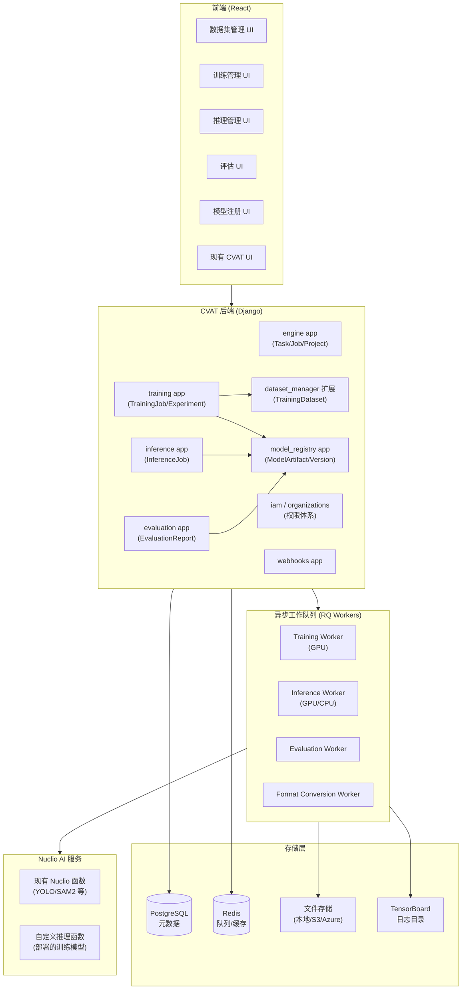
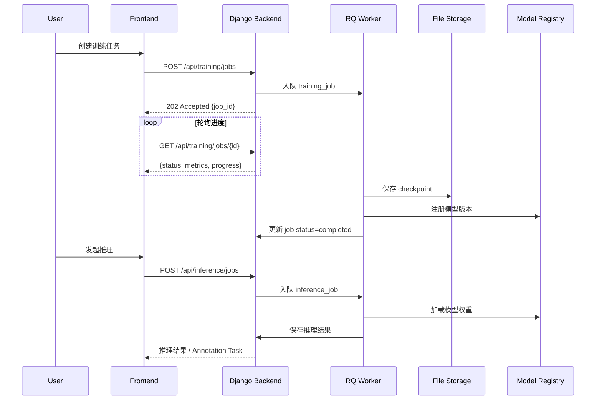
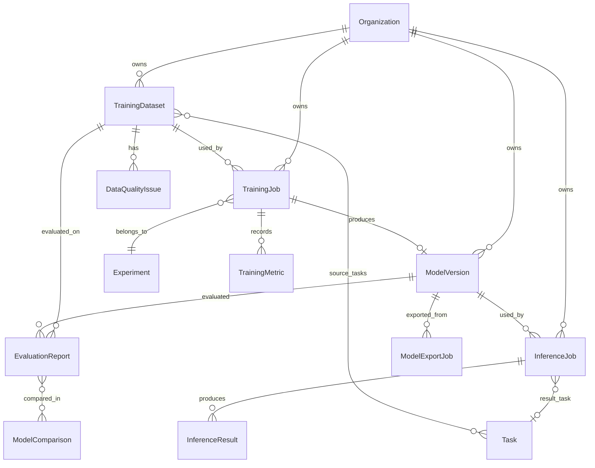
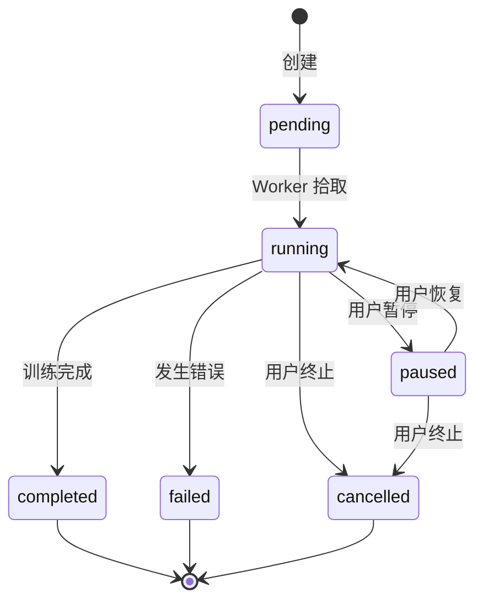
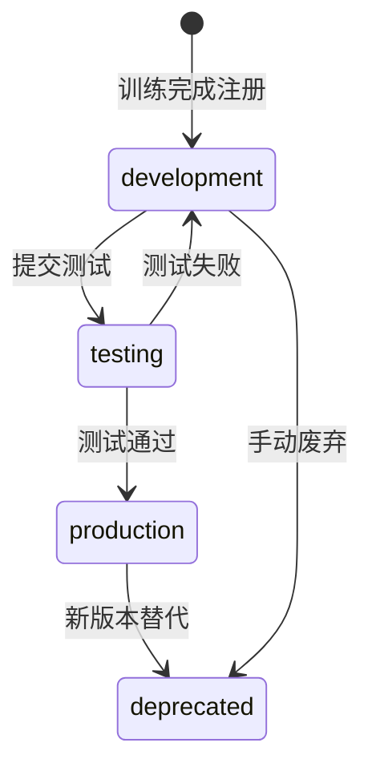
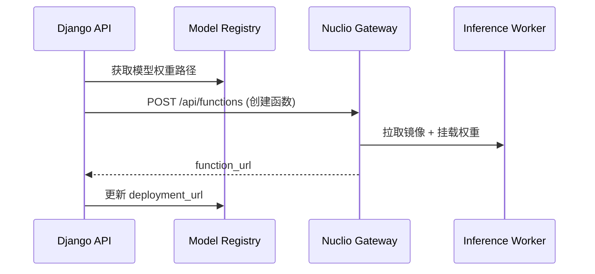

# Design Document: Object Detection Platform

## Overview

本设计文档描述了将 CVAT 改造为端到端目标检测平台的技术方案。平台在 CVAT 现有微服务架构（Django 后端、React 前端、Nuclio AI 服务、PostgreSQL/Redis 存储）基础上，新增训练服务（Training Service）、推理服务（Inference Service）、模型注册中心（Model Registry）、数据集管理器（Dataset Manager 扩展）和评估引擎（Evaluation Engine），形成从数据标注到模型训练、评估、部署的完整工作流。

### 设计目标

- **最小侵入**：尽量复用 CVAT 现有代码和基础设施，新功能以独立 Django App 或独立微服务形式接入
- **异步优先**：训练和推理均为长时任务，全部通过 RQ（Redis Queue）异步执行
- **可扩展**：Training Service 和 Inference Service 可独立水平扩展
- **权限继承**：完全复用 CVAT 现有的 Organization / IAM 权限体系

---

## Architecture

### 高层架构图



### 服务交互流程



---

## Components and Interfaces

### 1. Training App (`cvat/apps/training`)

负责训练任务的创建、调度、监控和管理。

**核心类：**

```python
class TrainingJob(TimestampedModel):
    """训练任务主模型"""
    id: UUID
    name: str
    status: TrainingJobStatus  # pending/running/paused/completed/failed/cancelled
    owner: ForeignKey(User)
    organization: ForeignKey(Organization)
    dataset: ForeignKey(TrainingDataset)
    model_arch: str            # yolov8n/yolov8s/yolov9c/faster_rcnn/retinanet
    pretrained_model: ForeignKey(ModelVersion, null=True)
    hyperparams: JSONField     # lr, batch_size, epochs, optimizer, ...
    augmentation_config: JSONField
    distributed_config: JSONField  # num_gpus, num_nodes
    rq_job_id: str
    current_epoch: int
    total_epochs: int
    best_metric: float         # best mAP
    error_message: str
    experiment: ForeignKey(Experiment)

class Experiment(TimestampedModel):
    """实验记录，聚合多个 TrainingJob"""
    name: str
    description: str
    tags: ArrayField
    owner: ForeignKey(User)
    organization: ForeignKey(Organization)

class TrainingMetric(models.Model):
    """训练指标时序数据"""
    job: ForeignKey(TrainingJob)
    epoch: int
    step: int
    metric_name: str   # train/loss, val/mAP50, val/precision, ...
    value: float
    timestamp: DateTimeField
```

**RQ Task 接口：**

```python
def run_training_job(job_id: UUID) -> None:
    """RQ 工作函数，在 GPU Worker 上执行"""
    ...

def pause_training_job(job_id: UUID) -> None: ...
def resume_training_job(job_id: UUID) -> None: ...
def cancel_training_job(job_id: UUID) -> None: ...
```

### 2. Model Registry App (`cvat/apps/model_registry`)

管理模型版本、文件存储和状态流转。

**核心类：**

```python
class ModelVersion(TimestampedModel):
    id: UUID
    name: str
    version: str               # 语义化版本 e.g. "1.0.0"
    model_arch: str
    status: ModelStatus        # development/testing/production/deprecated
    owner: ForeignKey(User)
    organization: ForeignKey(Organization)
    training_job: ForeignKey(TrainingJob, null=True)
    dataset: ForeignKey(TrainingDataset, null=True)
    metrics: JSONField         # {mAP50: 0.85, precision: 0.88, recall: 0.82}
    labels: JSONField          # 类别列表
    artifact_path: str         # 文件存储路径
    file_size: int
    framework: str             # pytorch/onnx/tensorrt/openvino
    tags: ArrayField
    description: str
    is_deleted: bool           # 软删除

class ModelExportJob(TimestampedModel):
    """模型格式转换任务"""
    source_model: ForeignKey(ModelVersion)
    target_format: str         # onnx/torchscript/tensorrt/openvino
    quantization: str          # none/fp16/int8
    status: JobStatus
    result_model: ForeignKey(ModelVersion, null=True)
    accuracy_delta: float      # 转换前后精度差
    rq_job_id: str
```

### 3. Inference App (`cvat/apps/inference`)

管理推理任务的执行和结果存储。

**核心类：**

```python
class InferenceJob(TimestampedModel):
    id: UUID
    name: str
    status: InferenceJobStatus  # pending/running/completed/failed
    owner: ForeignKey(User)
    organization: ForeignKey(Organization)
    model_version: ForeignKey(ModelVersion)
    source_task: ForeignKey(Task, null=True)    # CVAT Task
    source_project: ForeignKey(Project, null=True)
    conf_threshold: float      # 置信度阈值
    iou_threshold: float       # NMS IoU 阈值
    batch_size: int
    save_as_annotation: bool
    result_task: ForeignKey(Task, null=True)   # 保存结果的 CVAT Task
    total_frames: int
    processed_frames: int
    rq_job_id: str
    error_message: str

class InferenceResult(models.Model):
    """单帧推理结果"""
    job: ForeignKey(InferenceJob)
    frame_index: int
    detections: JSONField      # [{label, bbox, confidence}, ...]
    processing_time_ms: float
```

### 4. Evaluation App (`cvat/apps/evaluation`)

计算模型性能指标，生成评估报告。

**核心类：**

```python
class EvaluationReport(TimestampedModel):
    id: UUID
    model_version: ForeignKey(ModelVersion)
    dataset: ForeignKey(TrainingDataset)
    iou_threshold: float
    owner: ForeignKey(User)
    organization: ForeignKey(Organization)
    status: JobStatus
    # 汇总指标
    map50: float
    map50_95: float
    precision: float
    recall: float
    f1_score: float
    per_class_metrics: JSONField   # {class_name: {ap, precision, recall}}
    confusion_matrix: JSONField    # 二维数组
    pr_curve_data: JSONField       # {class: [{precision, recall}, ...]}
    rq_job_id: str

class ModelComparison(TimestampedModel):
    """多模型对比"""
    name: str
    reports: ManyToManyField(EvaluationReport)
    owner: ForeignKey(User)
    organization: ForeignKey(Organization)
```

### 5. Dataset Manager 扩展 (`cvat/apps/dataset_manager` 扩展)

在现有 `dataset_manager` 基础上新增 `TrainingDataset` 模型。

**核心类：**

```python
class TrainingDataset(TimestampedModel):
    id: UUID
    name: str
    version: str
    owner: ForeignKey(User)
    organization: ForeignKey(Organization)
    source_tasks: ManyToManyField(Task)    # 来源 CVAT Task
    train_ratio: float         # 训练集比例 e.g. 0.7
    val_ratio: float           # 验证集比例 e.g. 0.2
    test_ratio: float          # 测试集比例 e.g. 0.1
    split_seed: int            # 随机种子，保证可复现
    total_images: int
    train_images: int
    val_images: int
    test_images: int
    label_stats: JSONField     # {class_name: count}
    quality_score: float
    export_path: str           # 导出文件路径
    format: str                # yolo/coco/voc

class DataQualityIssue(models.Model):
    """数据质量问题记录"""
    dataset: ForeignKey(TrainingDataset)
    task: ForeignKey(Task)
    frame_index: int
    issue_type: str    # overlapping_bbox/invalid_size/label_error/class_imbalance
    severity: str      # warning/error
    description: str
    annotation_id: int
    is_resolved: bool
```

---

## Data Models

### 数据库 ER 图



### 关键字段约束

| 模型 | 字段 | 约束 |
|------|------|------|
| `TrainingDataset` | `train_ratio + val_ratio + test_ratio` | 必须等于 1.0 |
| `ModelVersion` | `version` | 在同一 organization 内唯一 |
| `TrainingJob` | `status` 转换 | 只允许合法状态流转 |
| `InferenceJob` | `conf_threshold` | 0.0 ~ 1.0 |
| `EvaluationReport` | `iou_threshold` | 0.0 ~ 1.0 |

### 状态机

**TrainingJob 状态流转：**



**ModelVersion 状态流转：**



---

## API Design

所有新 API 遵循 CVAT 现有 REST 风格，挂载在 `/api/` 前缀下，使用 DRF + drf-spectacular 生成 OpenAPI 文档。

### 数据集管理 API

```
GET    /api/training/datasets                    # 列表
POST   /api/training/datasets                    # 从 CVAT Task 创建
GET    /api/training/datasets/{id}               # 详情
DELETE /api/training/datasets/{id}               # 删除
GET    /api/training/datasets/{id}/stats         # 统计信息（类别分布等）
POST   /api/training/datasets/{id}/export        # 导出（YOLO/COCO/VOC）
GET    /api/training/datasets/{id}/quality       # 质量报告
POST   /api/training/datasets/{id}/quality/check # 触发质量检查
```

### 训练任务 API

```
GET    /api/training/jobs                        # 列表（支持过滤/排序）
POST   /api/training/jobs                        # 创建训练任务
GET    /api/training/jobs/{id}                   # 详情（含实时指标）
DELETE /api/training/jobs/{id}                   # 删除记录
POST   /api/training/jobs/{id}/pause             # 暂停
POST   /api/training/jobs/{id}/resume            # 恢复
POST   /api/training/jobs/{id}/cancel            # 终止
GET    /api/training/jobs/{id}/metrics           # 历史指标（分页）
GET    /api/training/jobs/{id}/logs              # 实时日志（SSE）
GET    /api/training/jobs/{id}/checkpoints       # checkpoint 列表
```

### 实验管理 API

```
GET    /api/training/experiments                 # 列表
POST   /api/training/experiments                 # 创建
GET    /api/training/experiments/{id}            # 详情
PATCH  /api/training/experiments/{id}            # 更新标签/描述
GET    /api/training/experiments/{id}/compare    # 实验对比
POST   /api/training/experiments/{id}/reproduce  # 复现实验
```

### 模型注册 API

```
GET    /api/models                               # 列表
POST   /api/models                               # 手动注册
GET    /api/models/{id}                          # 详情
PATCH  /api/models/{id}                          # 更新标签/状态/描述
DELETE /api/models/{id}                          # 软删除
GET    /api/models/{id}/download                 # 下载权重文件
POST   /api/models/{id}/export                   # 格式转换（ONNX/TensorRT）
POST   /api/models/{id}/deploy                   # 部署为 Nuclio 函数
GET    /api/models/{id}/deployments              # 部署状态
```

### 推理任务 API

```
GET    /api/inference/jobs                       # 列表
POST   /api/inference/jobs                       # 创建推理任务
GET    /api/inference/jobs/{id}                  # 详情（含进度）
DELETE /api/inference/jobs/{id}                  # 删除
POST   /api/inference/jobs/{id}/retry            # 重试失败任务
GET    /api/inference/jobs/{id}/results          # 推理结果（分页）
POST   /api/inference/jobs/{id}/export           # 导出结果（JSON/CSV/COCO）
```

### 评估 API

```
GET    /api/evaluation/reports                   # 列表
POST   /api/evaluation/reports                   # 创建评估任务
GET    /api/evaluation/reports/{id}              # 详情（含指标）
GET    /api/evaluation/reports/{id}/confusion    # 混淆矩阵数据
GET    /api/evaluation/reports/{id}/pr_curve     # PR 曲线数据
GET    /api/evaluation/reports/{id}/failures     # FP/FN 案例
POST   /api/evaluation/reports/{id}/export       # 导出报告（PDF/HTML）
POST   /api/evaluation/comparisons               # 创建多模型对比
GET    /api/evaluation/comparisons/{id}          # 对比详情
```

### 请求/响应示例

**创建训练任务：**

```json
POST /api/training/jobs
{
  "name": "yolov8-experiment-01",
  "dataset_id": "uuid-...",
  "model_arch": "yolov8n",
  "pretrained_model_id": null,
  "hyperparams": {
    "epochs": 100,
    "batch_size": 16,
    "lr0": 0.01,
    "optimizer": "AdamW",
    "weight_decay": 0.0005
  },
  "augmentation_config": {
    "hsv_h": 0.015,
    "flipud": 0.0,
    "fliplr": 0.5,
    "mosaic": 1.0
  },
  "distributed_config": {
    "num_gpus": 1
  },
  "experiment_id": "uuid-..."
}
```

**响应：**

```json
{
  "id": "uuid-...",
  "status": "pending",
  "created_date": "2025-01-01T00:00:00Z",
  "rq_job_id": "rq-uuid-..."
}
```

---

## Frontend Components

前端在现有 CVAT React 应用基础上新增以下页面和组件，遵循现有 Ant Design 组件库风格。

### 页面结构

```
/training
  /datasets          → DatasetListPage
  /datasets/:id      → DatasetDetailPage（含质量报告）
  /jobs              → TrainingJobListPage
  /jobs/new          → TrainingJobCreatePage（向导式表单）
  /jobs/:id          → TrainingJobDetailPage（实时曲线）
  /experiments       → ExperimentListPage
  /experiments/:id   → ExperimentDetailPage（对比视图）

/models
  /                  → ModelRegistryPage
  /:id               → ModelDetailPage（含部署管理）

/inference
  /jobs              → InferenceJobListPage
  /jobs/new          → InferenceJobCreatePage
  /jobs/:id          → InferenceJobDetailPage

/evaluation
  /reports           → EvaluationReportListPage
  /reports/:id       → EvaluationReportDetailPage（混淆矩阵、PR 曲线）
  /comparisons/:id   → ModelComparisonPage
```

### 关键组件

| 组件 | 功能 |
|------|------|
| `TrainingCurveChart` | 使用 Recharts 渲染实时 loss/mAP 曲线，通过 SSE 接收更新 |
| `ConfusionMatrixHeatmap` | 混淆矩阵热力图 |
| `PRCurveChart` | 每类别 PR 曲线 |
| `ModelVersionSelector` | 带搜索和过滤的模型版本选择器 |
| `DatasetSplitConfig` | 训练/验证/测试集比例配置（滑块） |
| `HyperparamForm` | 超参数配置表单（含预设模板） |
| `ResourceQuotaIndicator` | GPU 配额使用进度条 |
| `JobStatusBadge` | 任务状态徽章（带颜色） |

### 实时更新策略

训练进度通过 **Server-Sent Events (SSE)** 推送，避免轮询开销：

```
GET /api/training/jobs/{id}/logs  →  text/event-stream
```

前端使用 `EventSource` API 订阅，收到 `metric` 事件时更新图表，收到 `status` 事件时更新任务状态。

---

## Integration with Existing CVAT

### 1. 权限集成

新增 App 的所有 ViewSet 继承 CVAT 现有 `PermissionMixin`，权限规则文件放在各 App 的 `rules/` 目录下，与现有 `engine`、`lambda_manager` 保持一致：

```python
# cvat/apps/training/permissions.py
class TrainingJobPermission(OpenPolicyAgentPermission):
    class Scopes(StrEnum):
        LIST = "list"
        CREATE = "create"
        VIEW = "view"
        UPDATE = "update"
        DELETE = "delete"
        MANAGE = "manage"  # pause/resume/cancel
```

### 2. 与 CVAT Task 集成

- `TrainingDataset` 通过 `source_tasks` ManyToMany 关联 CVAT `Task`
- `InferenceJob` 的结果可通过现有 `dataset_manager` 导入接口写回为新的 CVAT `Task`
- 自动标注功能复用 `lambda_manager` 的 `LambdaJob` 机制，将训练好的模型注册为 Nuclio 函数后即可在 CVAT 标注界面使用

### 3. 与 Nuclio 集成

模型部署流程：



部署后的模型函数遵循现有 `ai-models/detector/yolo/func.py` 接口规范，可直接在 CVAT 标注界面的 AI 工具中使用。

### 4. RQ 队列集成

新增两个 RQ 队列，在 `cvat/settings/base.py` 中注册：

```python
RQ_QUEUES = {
    ...existing...,
    "training": {
        "HOST": REDIS_HOST,
        "PORT": REDIS_PORT,
        "DB": 0,
        "DEFAULT_TIMEOUT": 86400,  # 24h
    },
    "inference": {
        "HOST": REDIS_HOST,
        "PORT": REDIS_PORT,
        "DB": 0,
        "DEFAULT_TIMEOUT": 3600,   # 1h
    },
}
```

### 5. Webhook 集成

复用现有 `webhooks` App，新增事件类型：

```python
class WebhookEventType(str, Enum):
    ...existing...,
    TRAINING_JOB_COMPLETED = "training:job:completed"
    TRAINING_JOB_FAILED = "training:job:failed"
    INFERENCE_JOB_COMPLETED = "inference:job:completed"
    MODEL_REGISTERED = "model:registered"
    EVALUATION_COMPLETED = "evaluation:completed"
```

---

## Technology Stack

### 后端新增依赖

| 库 | 版本 | 用途 |
|----|------|------|
| `ultralytics` | ≥8.3 | YOLOv8/v9 训练和推理 |
| `torchvision` | ≥0.18 | Faster RCNN / RetinaNet |
| `onnx` | ≥1.16 | ONNX 格式导出 |
| `onnxruntime-gpu` | ≥1.18 | ONNX 推理 |
| `tensorboard` | ≥2.17 | 训练可视化 |
| `pycocotools` | ≥2.0 | COCO 格式评估 |
| `mlflow` | ≥2.14 | 实验追踪（可选，替代自研） |
| `boto3` | 已有 | S3 模型文件存储 |

### 前端新增依赖

| 库 | 版本 | 用途 |
|----|------|------|
| `recharts` | ≥2.12 | 训练曲线图表 |
| `@ant-design/plots` | ≥2.2 | 混淆矩阵热力图 |

### 基础设施

| 组件 | 方案 |
|------|------|
| 模型文件存储 | 本地文件系统（开发）/ S3 兼容存储（生产），复用 CVAT 现有 `CloudStorage` 机制 |
| GPU 调度 | Docker Compose GPU 设备分配（开发）/ Kubernetes GPU 节点池（生产） |
| TensorBoard | 独立容器，挂载训练日志目录 |
| 模型缓存 | Redis，缓存推理时的模型加载结果（TTL 1h） |

---


## Correctness Properties

*A property is a characteristic or behavior that should hold true across all valid executions of a system — essentially, a formal statement about what the system should do. Properties serve as the bridge between human-readable specifications and machine-verifiable correctness guarantees.*

### Property 1: 数据集标注完整性

*For any* 一组已完成的 Annotation_Task 集合，从这些 Task 创建的 TrainingDataset 所包含的标注数量，应等于所有源 Task 中标注数量的总和。

**Validates: Requirements 1.1**

---

### Property 2: 数据集划分比例一致性

*For any* 有效的划分比例配置（train_ratio + val_ratio + test_ratio = 1.0）和任意大小的数据集，划分后三个子集的样本总数应等于原始数据集的样本总数，且每个子集的实际比例与指定比例的误差不超过 1/N（N 为总样本数）。

**Validates: Requirements 1.2**

---

### Property 3: 数据集导出格式可解析性（Round-trip）

*For any* 包含标注数据的 TrainingDataset，将其导出为 YOLO、COCO 或 Pascal VOC 格式后，使用对应格式的解析器重新读取，应能还原出与原始数据集等价的标注集合（类别、边界框坐标、图像关联关系均一致）。

**Validates: Requirements 1.3**

---

### Property 4: 数据集元数据完整性

*For any* 成功创建的 TrainingDataset，其元数据记录必须包含非空的版本号、创建时间、数据来源列表和统计信息（label_stats 字段非空且包含所有出现过的类别）。

**Validates: Requirements 1.4, 1.5**

---

### Property 5: 训练配置验证正确性

*For any* 训练配置对象，验证函数应正确区分有效配置（合法架构名、超参数在合理范围内、比例参数在 [0,1] 内）和无效配置（未知架构名、负学习率、批次大小为零等），不应出现将无效配置接受或将有效配置拒绝的情况。

**Validates: Requirements 2.1, 2.2, 2.4, 2.5**

---

### Property 6: 训练指标记录完整性

*For any* 完成了 E 个 epoch 的训练任务，数据库中应存在恰好 E 条对应该任务的 TrainingMetric 记录，且每条记录的 epoch 字段值在 [1, E] 范围内且互不重复。

**Validates: Requirements 3.2**

---

### Property 7: Checkpoint 保存频率一致性

*For any* 训练任务，若配置了 checkpoint_interval = N 且训练完成了 E 个 epoch，则保存的 checkpoint 数量应为 ⌊E / N⌋，且每个 checkpoint 对应的 epoch 编号均为 N 的倍数。

**Validates: Requirements 3.3**

---

### Property 8: 训练完成后模型注册一致性（Round-trip）

*For any* 成功完成的 TrainingJob，Model_Registry 中应存在且仅存在一个与该 job 关联的 ModelVersion，该 ModelVersion 的元数据（架构、训练数据集、性能指标）应与 TrainingJob 的记录完全一致。

**Validates: Requirements 3.5, 5.1, 5.3**

---

### Property 9: 训练任务状态机合法性

*For any* TrainingJob 的当前状态，只有合法的状态转换应被允许：pending→running、running→paused、running→completed、running→failed、running→cancelled、paused→running、paused→cancelled。所有其他状态转换（如 completed→running、failed→paused 等）应被拒绝。

**Validates: Requirements 3.6**

---

### Property 10: 模型版本号唯一性

*For any* 同一 Organization 内注册的多个 ModelVersion，其版本号（version 字段）应两两不同；跨 Organization 的模型版本号可以相同。

**Validates: Requirements 5.1**

---

### Property 11: 模型状态机合法性

*For any* ModelVersion 的当前状态，只有合法的状态转换应被允许：development→testing、testing→production、testing→development、production→deprecated、development→deprecated。所有其他转换应被拒绝。

**Validates: Requirements 5.5**

---

### Property 12: 模型格式转换精度保持性

*For any* 以 PyTorch 格式存储的 ModelVersion，将其转换为 ONNX 格式后，在相同输入图像上运行推理，两个模型输出的检测框坐标差异应在 1e-4 以内，置信度差异应在 1e-3 以内（FP32 转换），或在指定的精度损失容忍范围内（量化转换）。

**Validates: Requirements 5.7, 15.4**

---

### Property 13: 推理结果结构完整性

*For any* 成功完成的推理请求，返回的每个检测结果对象必须包含有效的边界框（4 个坐标值，且 x2 > x1，y2 > y1），类别标签（非空字符串），以及置信度分数（在 [0.0, 1.0] 范围内）。

**Validates: Requirements 6.1, 6.5**

---

### Property 14: 批量推理结果数量一致性

*For any* 包含 N 张图像的批量推理请求，推理结果集合中应恰好包含 N 个结果条目（每张图像对应一个结果，即使该图像无检测结果也应返回空列表）。

**Validates: Requirements 6.2**

---

### Property 15: 置信度阈值过滤正确性

*For any* 推理结果集合和任意置信度阈值 T ∈ [0.0, 1.0]，经过阈值过滤后返回的所有检测结果的置信度值均应满足 confidence ≥ T，不应存在置信度低于 T 的检测结果被返回。

**Validates: Requirements 6.3**

---

### Property 16: NMS 后无重叠框不变量

*For any* 检测结果集合和 NMS IoU 阈值 T，经过 NMS 处理后，同一类别的任意两个剩余检测框之间的 IoU 值均应小于 T。

**Validates: Requirements 6.4**

---

### Property 17: 推理结果保存为标注任务的一致性（Round-trip）

*For any* 推理任务的检测结果，将其保存为 CVAT Annotation_Task 后，通过 CVAT API 读取该 Task 的标注数据，应能还原出与原始推理结果等价的标注集合（类别、边界框坐标、置信度均一致）。

**Validates: Requirements 6.6**

---

### Property 18: 评估指标类别覆盖完整性

*For any* 包含 N 个类别的测试数据集上运行的评估任务，生成的 EvaluationReport 中 per_class_metrics 字段应包含恰好 N 个条目，每个类别均有对应的 AP、Precision、Recall 指标。

**Validates: Requirements 8.2**

---

### Property 19: 混淆矩阵维度一致性

*For any* 包含 N 个类别的评估任务，生成的混淆矩阵应为 (N+1) × (N+1) 的方阵（额外一行/列表示背景类），且矩阵中所有元素均为非负整数。

**Validates: Requirements 8.3**

---

### Property 20: mAP 随 IoU 阈值的单调性

*For any* 模型和测试数据集，在不同 IoU 阈值 T1 < T2 下计算的 mAP 值应满足 mAP(T1) ≥ mAP(T2)（更严格的匹配标准不会产生更高的 mAP）。

**Validates: Requirements 8.5**

---

### Property 21: 权限隔离性

*For any* 属于 Organization A 的 TrainingJob、ModelVersion 或 InferenceJob，Organization B 的成员（非平台管理员）在未被明确授权的情况下，不应能够读取、修改或删除这些资源。

**Validates: Requirements 12.1, 12.6**

---

### Property 22: 实验参数记录完整性

*For any* 创建的 TrainingJob，与之关联的 Experiment 记录应包含该 Job 的所有配置参数（模型架构、超参数、数据集 ID、数据增强配置），以确保实验可复现。

**Validates: Requirements 13.2, 13.6**

---

## Error Handling

### 训练服务错误处理

| 错误场景 | 处理策略 |
|----------|----------|
| GPU 内存不足（OOM） | 捕获 CUDA OOM 异常，将 job 状态设为 `failed`，记录错误信息，建议用户减小 batch_size |
| 训练数据集为空 | 在创建 TrainingJob 时同步验证，返回 400 Bad Request |
| Worker 进程崩溃 | RQ 的 `job_execution_timeout` 触发后，将 job 标记为 `failed`；支持手动重试 |
| Checkpoint 写入失败 | 记录警告日志，继续训练，不中断任务 |
| 模型注册失败 | 训练完成后注册失败时，保留权重文件，允许手动重新注册 |

### 推理服务错误处理

| 错误场景 | 处理策略 |
|----------|----------|
| 模型文件不存在 | 返回 404，提示用户检查模型状态 |
| 输入图像格式不支持 | 跳过该帧，记录到错误日志，继续处理其他帧 |
| 推理超时 | 单帧超时后跳过，整体任务超时后标记为 `failed` |
| 结果写回 CVAT 失败 | 保留推理结果 JSON，允许手动重新导入 |

### API 错误响应格式

遵循 CVAT 现有错误响应格式：

```json
{
  "detail": "错误描述信息"
}
```

对于验证错误：

```json
{
  "field_name": ["错误描述"]
}
```

---

## Testing Strategy

### 测试分层

**单元测试（Unit Tests）**

针对纯函数和业务逻辑：

- 数据集划分算法（`split_dataset`）
- 训练配置验证逻辑（`validate_training_config`）
- 置信度过滤函数（`filter_by_confidence`）
- NMS 实现（`apply_nms`）
- mAP 计算函数（`compute_map`）
- 状态机转换验证（`validate_state_transition`）
- 模型版本号生成逻辑

**属性测试（Property-Based Tests）**

使用 **Hypothesis** 库（Python 生态标准 PBT 库），每个属性测试运行最少 **100 次迭代**。

属性测试覆盖上述 22 个 Correctness Properties，每个测试用例标注格式：

```python
# Feature: object-detection-platform, Property 15: 置信度阈值过滤正确性
@given(
    detections=st.lists(detection_strategy(), min_size=0, max_size=50),
    threshold=st.floats(min_value=0.0, max_value=1.0)
)
@settings(max_examples=100)
def test_confidence_threshold_filtering(detections, threshold):
    filtered = filter_by_confidence(detections, threshold)
    assert all(d.confidence >= threshold for d in filtered)
```

**集成测试（Integration Tests）**

针对服务间交互，使用 1-3 个代表性示例：

- 训练任务完整流程（创建→执行→注册）
- 推理任务完整流程（创建→执行→保存为 Task）
- 模型部署到 Nuclio（使用 mock Nuclio 服务）
- Webhook 事件触发验证

**冒烟测试（Smoke Tests）**

- 新增 Django App 正确注册
- RQ 队列连接正常
- 文件存储路径可写
- API 端点返回正确 HTTP 状态码

### 属性测试生成器策略

```python
# 核心数据生成器
@st.composite
def detection_strategy(draw):
    x1 = draw(st.floats(min_value=0, max_value=900))
    y1 = draw(st.floats(min_value=0, max_value=900))
    x2 = draw(st.floats(min_value=x1 + 1, max_value=1000))
    y2 = draw(st.floats(min_value=y1 + 1, max_value=1000))
    return Detection(
        bbox=[x1, y1, x2, y2],
        label=draw(st.text(min_size=1, max_size=50)),
        confidence=draw(st.floats(min_value=0.0, max_value=1.0))
    )

@st.composite
def split_ratio_strategy(draw):
    a = draw(st.floats(min_value=0.1, max_value=0.8))
    b = draw(st.floats(min_value=0.1, max_value=1.0 - a))
    c = 1.0 - a - b
    assume(c >= 0.05)
    return (a, b, c)
```

### 测试运行命令

```bash
# 单元测试 + 属性测试
python manage.py test cvat.apps.training cvat.apps.model_registry \
    cvat.apps.inference cvat.apps.evaluation

# 仅属性测试（带详细输出）
pytest cvat/apps/*/tests/test_properties.py -v --hypothesis-show-statistics

# 集成测试（需要 Docker 环境）
pytest cvat/apps/*/tests/test_integration.py -v -m integration
```


### 6. Data Augmentation Manager (`cvat/apps/training` 模块)

管理数据增强配置、预览和应用。

**核心类：**

```python
class AugmentationTemplate(TimestampedModel):
    """数据增强配置模板"""
    id: UUID
    name: str
    description: str
    owner: ForeignKey(User)
    organization: ForeignKey(Organization)
    config: JSONField          # 完整增强配置
    intensity: str             # light/medium/heavy
    is_public: bool            # 是否公开共享
    usage_count: int           # 使用次数统计

class AugmentationConfig(models.Model):
    """数据增强配置（嵌入在 TrainingJob 中）"""
    # 几何变换
    flip_horizontal: float     # 水平翻转概率 [0.0-1.0]
    flip_vertical: float       # 垂直翻转概率
    rotate_degree: int         # 旋转角度范围 [-degree, +degree]
    rotate_prob: float         # 旋转概率
    scale_min: float           # 最小缩放比例 e.g. 0.5
    scale_max: float           # 最大缩放比例 e.g. 1.5
    scale_prob: float          # 缩放概率
    translate_x: float         # X轴平移范围 [0.0-1.0]
    translate_y: float         # Y轴平移范围
    translate_prob: float      # 平移概率
    shear_degree: int          # 剪切角度范围
    shear_prob: float          # 剪切概率
    perspective_prob: float    # 透视变换概率

    # 颜色空间变换
    hsv_h: float               # 色调调整范围 [0.0-1.0]
    hsv_s: float               # 饱和度调整范围
    hsv_v: float               # 明度调整范围
    brightness: float          # 亮度调整范围
    contrast: float            # 对比度调整范围
    grayscale_prob: float      # 灰度化概率
    blur_prob: float           # 模糊概率
    blur_kernel: int           # 模糊核大小
    noise_prob: float          # 噪声添加概率
    noise_type: str            # gaussian/salt_pepper

    # 高级增强
    mosaic_prob: float         # Mosaic 增强概率
    mixup_prob: float          # MixUp 增强概率
    mixup_alpha: float         # MixUp alpha 参数
    cutout_prob: float         # CutOut 概率
    cutout_ratio: float        # CutOut 遮挡比例
    copy_paste_prob: float     # CopyPaste 概率

    # 增强管道
    pipeline: JSONField        # 自定义增强顺序 [{type, params, prob}, ...]

    # 类别特定配置
    class_specific: JSONField  # {class_name: {augmentation_config}, ...}

class AugmentationPreview(models.Model):
    """增强预览记录"""
    id: UUID
    user: ForeignKey(User)
    dataset: ForeignKey(TrainingDataset)
    config: JSONField
    sample_images: JSONField   # [{original_url, augmented_url, annotations}, ...]
    created_date: DateTimeField
    expires_at: DateTimeField  # 预览图片过期时间
```

**数据增强工具函数：**

```python
# cvat/apps/training/augmentation.py

from albumentations import (
    Compose, HorizontalFlip, VerticalFlip, Rotate,
    RandomScale, ShiftScaleRotate, Perspective,
    HueSaturationValue, RandomBrightnessContrast,
    GaussianBlur, GaussNoise, CoarseDropout
)
from albumentations.pytorch import ToTensorV2

class AugmentationPipeline:
    """数据增强管道"""

    def __init__(self, config: AugmentationConfig):
        self.config = config
        self.transform = self._build_transform()

    def _build_transform(self):
        """根据配置构建 Albumentations 变换"""
        transforms = []

        # 几何变换
        if self.config.flip_horizontal > 0:
            transforms.append(HorizontalFlip(p=self.config.flip_horizontal))

        if self.config.flip_vertical > 0:
            transforms.append(VerticalFlip(p=self.config.flip_vertical))

        if self.config.rotate_prob > 0:
            transforms.append(Rotate(
                limit=self.config.rotate_degree,
                p=self.config.rotate_prob,
                border_mode=cv2.BORDER_CONSTANT
            ))

        if self.config.scale_prob > 0:
            transforms.append(RandomScale(
                scale_limit=(self.config.scale_min - 1, self.config.scale_max - 1),
                p=self.config.scale_prob
            ))

        # 颜色空间变换
        if self.config.hsv_h > 0 or self.config.hsv_s > 0 or self.config.hsv_v > 0:
            transforms.append(HueSaturationValue(
                hue_shift_limit=int(self.config.hsv_h * 180),
                sat_shift_limit=int(self.config.hsv_s * 255),
                val_shift_limit=int(self.config.hsv_v * 255),
                p=0.5
            ))

        if self.config.brightness > 0 or self.config.contrast > 0:
            transforms.append(RandomBrightnessContrast(
                brightness_limit=self.config.brightness,
                contrast_limit=self.config.contrast,
                p=0.5
            ))

        # 高级增强
        if self.config.cutout_prob > 0:
            transforms.append(CoarseDropout(
                max_holes=8,
                max_height=int(640 * self.config.cutout_ratio),
                max_width=int(640 * self.config.cutout_ratio),
                p=self.config.cutout_prob
            ))

        return Compose(
            transforms,
            bbox_params=BboxParams(
                format='yolo',
                label_fields=['class_labels'],
                min_visibility=0.3  # 过滤掉可见度低于30%的框
            )
        )

    def apply(self, image, bboxes, labels):
        """应用增强"""
        augmented = self.transform(
            image=image,
            bboxes=bboxes,
            class_labels=labels
        )
        return augmented['image'], augmented['bboxes'], augmented['class_labels']

    def apply_mosaic(self, images, bboxes_list, labels_list):
        """Mosaic 增强：将4张图像拼接"""
        assert len(images) == 4
        h, w = images[0].shape[:2]

        # 创建 2x2 拼接画布
        mosaic_img = np.zeros((h * 2, w * 2, 3), dtype=np.uint8)

        # 放置4张图像
        mosaic_img[0:h, 0:w] = images[0]
        mosaic_img[0:h, w:w*2] = images[1]
        mosaic_img[h:h*2, 0:w] = images[2]
        mosaic_img[h:h*2, w:w*2] = images[3]

        # 调整标注框坐标
        mosaic_bboxes = []
        mosaic_labels = []
        offsets = [(0, 0), (w, 0), (0, h), (w, h)]

        for i, (bboxes, labels, offset) in enumerate(zip(bboxes_list, labels_list, offsets)):
            for bbox, label in zip(bboxes, labels):
                x, y, w_box, h_box = bbox
                new_bbox = [
                    (x + offset[0]) / (w * 2),
                    (y + offset[1]) / (h * 2),
                    w_box / 2,
                    h_box / 2
                ]
                mosaic_bboxes.append(new_bbox)
                mosaic_labels.append(label)

        return mosaic_img, mosaic_bboxes, mosaic_labels

    def apply_mixup(self, img1, bboxes1, labels1, img2, bboxes2, labels2):
        """MixUp 增强：混合两张图像"""
        alpha = self.config.mixup_alpha
        lam = np.random.beta(alpha, alpha)

        # 混合图像
        mixed_img = (lam * img1 + (1 - lam) * img2).astype(np.uint8)

        # 合并标注框
        mixed_bboxes = bboxes1 + bboxes2
        mixed_labels = labels1 + labels2

        return mixed_img, mixed_bboxes, mixed_labels

    def validate_bboxes(self, bboxes, img_shape):
        """验证标注框有效性"""
        valid_bboxes = []
        h, w = img_shape[:2]

        for bbox in bboxes:
            x, y, w_box, h_box = bbox

            # 检查边界
            if x < 0 or y < 0 or x + w_box > w or y + h_box > h:
                continue

            # 检查面积
            if w_box * h_box < 1:
                continue

            valid_bboxes.append(bbox)

        return valid_bboxes


def generate_augmentation_preview(
    dataset_id: UUID,
    config: dict,
    num_samples: int = 6
) -> list[dict]:
    """生成增强预览"""
    dataset = TrainingDataset.objects.get(id=dataset_id)
    pipeline = AugmentationPipeline(AugmentationConfig(**config))

    # 随机选择样本
    samples = random.sample(list(dataset.get_images()), num_samples)

    previews = []
    for img_path, bboxes, labels in samples:
        # 读取原始图像
        image = cv2.imread(img_path)

        # 应用增强
        aug_image, aug_bboxes, aug_labels = pipeline.apply(image, bboxes, labels)

        # 保存预览图像
        original_url = save_preview_image(image, bboxes, labels)
        augmented_url = save_preview_image(aug_image, aug_bboxes, aug_labels)

        previews.append({
            'original_url': original_url,
            'augmented_url': augmented_url,
            'original_annotations': {'bboxes': bboxes, 'labels': labels},
            'augmented_annotations': {'bboxes': aug_bboxes, 'labels': aug_labels}
        })

    return previews


def get_augmentation_statistics(
    dataset_id: UUID,
    config: dict,
    num_samples: int = 100
) -> dict:
    """统计增强效果"""
    dataset = TrainingDataset.objects.get(id=dataset_id)
    pipeline = AugmentationPipeline(AugmentationConfig(**config))

    stats = {
        'original': {'bbox_count': 0, 'avg_bbox_area': 0, 'class_distribution': {}},
        'augmented': {'bbox_count': 0, 'avg_bbox_area': 0, 'class_distribution': {}}
    }

    samples = random.sample(list(dataset.get_images()), num_samples)

    for img_path, bboxes, labels in samples:
        image = cv2.imread(img_path)

        # 原始统计
        stats['original']['bbox_count'] += len(bboxes)
        for label in labels:
            stats['original']['class_distribution'][label] = \
                stats['original']['class_distribution'].get(label, 0) + 1

        # 增强后统计
        aug_image, aug_bboxes, aug_labels = pipeline.apply(image, bboxes, labels)
        stats['augmented']['bbox_count'] += len(aug_bboxes)
        for label in aug_labels:
            stats['augmented']['class_distribution'][label] = \
                stats['augmented']['class_distribution'].get(label, 0) + 1

    return stats
```

---

### 数据增强 API 扩展

```
# 增强模板管理
GET    /api/training/augmentation/templates           # 列表（含公共模板）
POST   /api/training/augmentation/templates           # 创建模板
GET    /api/training/augmentation/templates/{id}      # 详情
PATCH  /api/training/augmentation/templates/{id}      # 更新
DELETE /api/training/augmentation/templates/{id}      # 删除
POST   /api/training/augmentation/templates/{id}/clone # 克隆模板

# 增强预览
POST   /api/training/augmentation/preview             # 生成预览
GET    /api/training/augmentation/preview/{id}        # 获取预览结果
POST   /api/training/augmentation/statistics          # 获取增强统计

# 离线增强
POST   /api/training/datasets/{id}/augment            # 应用离线增强
GET    /api/training/datasets/{id}/augment/status     # 查询增强进度
```

**创建增强模板示例：**

```json
POST /api/training/augmentation/templates
{
  "name": "YOLO 标准增强",
  "description": "适用于 YOLO 系列模型的标准增强配置",
  "intensity": "medium",
  "is_public": false,
  "config": {
    "flip_horizontal": 0.5,
    "flip_vertical": 0.0,
    "rotate_degree": 10,
    "rotate_prob": 0.3,
    "scale_min": 0.5,
    "scale_max": 1.5,
    "scale_prob": 0.5,
    "hsv_h": 0.015,
    "hsv_s": 0.7,
    "hsv_v": 0.4,
    "brightness": 0.2,
    "contrast": 0.2,
    "mosaic_prob": 1.0,
    "mixup_prob": 0.1,
    "mixup_alpha": 32.0,
    "cutout_prob": 0.0,
    "pipeline": [
      {"type": "mosaic", "prob": 1.0},
      {"type": "hsv", "prob": 1.0},
      {"type": "flip", "prob": 0.5},
      {"type": "scale", "prob": 0.5}
    ]
  }
}
```

**生成预览示例：**

```json
POST /api/training/augmentation/preview
{
  "dataset_id": "uuid-...",
  "config": {
    "flip_horizontal": 0.5,
    "rotate_degree": 15,
    "rotate_prob": 0.5,
    "hsv_h": 0.02,
    "hsv_s": 0.7,
    "hsv_v": 0.4
  },
  "num_samples": 6
}

# 响应
{
  "preview_id": "uuid-...",
  "samples": [
    {
      "original_url": "/media/augmentation/preview/original_1.jpg",
      "augmented_url": "/media/augmentation/preview/augmented_1.jpg",
      "original_annotations": {
        "bboxes": [[0.5, 0.5, 0.2, 0.3]],
        "labels": ["person"]
      },
      "augmented_annotations": {
        "bboxes": [[0.6, 0.4, 0.2, 0.3]],
        "labels": ["person"]
      }
    },
    ...
  ],
  "expires_at": "2025-01-02T00:00:00Z"
}
```

---

## Frontend Components (数据增强相关)

### 新增组件

| 组件 | 功能 |
|------|------|
| `AugmentationConfigPanel` | 数据增强配置面板（滑块、开关、输入框） |
| `AugmentationPreviewGrid` | 增强预览网格（原图 vs 增强图对比） |
| `AugmentationTemplateSelector` | 增强模板选择器（预设模板） |
| `AugmentationPipelineEditor` | 增强管道编辑器（拖拽排序） |
| `AugmentationStatisticsChart` | 增强效果统计图表 |
| `IntensityPresetButtons` | 强度预设按钮（轻度/中度/重度） |

### 页面集成

在训练任务创建/编辑页面添加"数据增强"标签页：

```typescript
// cvat-ui/src/components/training-page/training-job-form.tsx
<Tabs>
  <TabPane tab="基本配置" key="basic">
    <ModelArchSelector />
    <HyperparamsForm />
  </TabPane>

  <TabPane tab="数据增强" key="augmentation">
    <AugmentationConfigPanel
      value={augmentationConfig}
      onChange={setAugmentationConfig}
      onPreview={handlePreview}
    />
    <AugmentationPreviewGrid
      samples={previewSamples}
      loading={previewLoading}
    />
  </TabPane>

  <TabPane tab="分布式配置" key="distributed">
    <DistributedConfigForm />
  </TabPane>
</Tabs>
```

---

## Technology Stack (数据增强相关)

### 新增依赖

| 库 | 版本 | 用途 |
|----|------|------|
| `albumentations` | ≥1.4.0 | 数据增强库（支持目标检测） |
| `opencv-python` | ≥4.8.0 | 图像处理 |
| `imgaug` | ≥0.4.0 | 备选增强库 |

### 增强库选择理由

**Albumentations** 作为主要增强库：
- ✅ 原生支持目标检测（自动调整 bbox 坐标）
- ✅ 性能优异（基于 OpenCV 和 NumPy）
- ✅ 丰富的变换类型（80+ 种）
- ✅ 易于组合和配置
- ✅ 与 PyTorch/TensorFlow 无缝集成

---

## Correctness Properties (数据增强相关)

### Property 23: 增强后标注框坐标有效性

*For any* 图像和标注框集合，应用任意几何变换增强后，所有保留的标注框坐标均应在图像边界内，且框的宽度和高度均大于零。

**Validates: Requirements 16.8, 16.13**

---

### Property 24: 增强概率一致性

*For any* 增强配置中指定的概率值 P ∈ [0.0, 1.0]，在大量样本（N ≥ 1000）上应用该增强时，实际应用该增强的样本比例应接近 P，误差不超过 ±0.05。

**Validates: Requirements 16.9**

---

### Property 25: Mosaic 增强标注框数量守恒

*For any* 4 张图像及其标注框集合，应用 Mosaic 增强后，输出图像的标注框总数应等于输入 4 张图像的标注框总数之和（假设所有框都在有效范围内）。

**Validates: Requirements 16.4**

---

### Property 26: 增强配置可复现性

*For any* 训练任务和固定的随机种子，使用相同的增强配置在相同的数据集上应用增强，应产生完全相同的增强结果序列。

**Validates: Requirements 16.15**

---

### Property 27: 类别特定增强隔离性

*For any* 配置了类别特定增强的数据集，属于类别 A 的样本应用的增强策略不应影响属于类别 B 的样本的增强策略。

**Validates: Requirements 16.7**

---

## Testing Strategy (数据增强相关)

### 属性测试示例

```python
# cvat/apps/training/tests/test_augmentation_properties.py

from hypothesis import given, strategies as st
import hypothesis.strategies as st
from cvat.apps.training.augmentation import AugmentationPipeline

@given(
    flip_prob=st.floats(min_value=0.0, max_value=1.0),
    rotate_degree=st.integers(min_value=0, max_value=180),
    num_samples=st.integers(min_value=100, max_value=1000)
)
@settings(max_examples=100)
def test_augmentation_probability_consistency(flip_prob, rotate_degree, num_samples):
    """Property 24: 增强概率一致性"""
    config = AugmentationConfig(flip_horizontal=flip_prob)
    pipeline = AugmentationPipeline(config)

    # 生成测试样本
    applied_count = 0
    for _ in range(num_samples):
        image = np.random.randint(0, 255, (640, 640, 3), dtype=np.uint8)
        bboxes = [[0.5, 0.5, 0.2, 0.3]]
        labels = ['person']

        aug_image, _, _ = pipeline.apply(image, bboxes, labels)

        # 检测是否应用了翻转（通过图像差异判断）
        if not np.array_equal(image, aug_image):
            applied_count += 1

    actual_prob = applied_count / num_samples
    assert abs(actual_prob - flip_prob) <= 0.05


@given(
    bboxes=st.lists(
        st.tuples(
            st.floats(min_value=0.1, max_value=0.9),  # x
            st.floats(min_value=0.1, max_value=0.9),  # y
            st.floats(min_value=0.05, max_value=0.3), # w
            st.floats(min_value=0.05, max_value=0.3)  # h
        ),
        min_size=1,
        max_size=20
    )
)
@settings(max_examples=100)
def test_bbox_validity_after_augmentation(bboxes):
    """Property 23: 增强后标注框坐标有效性"""
    config = AugmentationConfig(
        flip_horizontal=0.5,
        rotate_degree=15,
        rotate_prob=0.5
    )
    pipeline = AugmentationPipeline(config)

    image = np.random.randint(0, 255, (640, 640, 3), dtype=np.uint8)
    labels = ['person'] * len(bboxes)

    aug_image, aug_bboxes, aug_labels = pipeline.apply(image, bboxes, labels)

    # 验证所有标注框有效
    for bbox in aug_bboxes:
        x, y, w, h = bbox
        assert 0 <= x <= 1, f"Invalid x: {x}"
        assert 0 <= y <= 1, f"Invalid y: {y}"
        assert 0 < w <= 1, f"Invalid width: {w}"
        assert 0 < h <= 1, f"Invalid height: {h}"
        assert x + w <= 1, f"Bbox exceeds right boundary"
        assert y + h <= 1, f"Bbox exceeds bottom boundary"
```

---

## Implementation Roadmap (数据增强部分)

### 阶段 1: 基础增强功能 (1 周)

1. 实现 `AugmentationConfig` 模型
2. 集成 Albumentations 库
3. 实现基础几何变换（翻转、旋转、缩放）
4. 实现基础颜色变换（HSV、亮度、对比度）
5. 编写单元测试

### 阶段 2: 高级增强功能 (1 周)

1. 实现 Mosaic 增强
2. 实现 MixUp 增强
3. 实现 CutOut 增强
4. 实现 CopyPaste 增强
5. 编写属性测试

### 阶段 3: 增强预览和模板 (1 周)

1. 实现 `AugmentationTemplate` 模型
2. 实现预览生成 API
3. 实现增强统计 API
4. 创建预设模板（轻度/中度/重度）
5. 编写集成测试

### 阶段 4: 前端集成 (1 周)

1. 实现 `AugmentationConfigPanel` 组件
2. 实现 `AugmentationPreviewGrid` 组件
3. 实现模板选择器
4. 集成到训练任务表单
5. 端到端测试

### 阶段 5: 优化和文档 (0.5 周)

1. 性能优化（缓存、并行处理）
2. 编写用户文档
3. 编写 API 文档
4. 代码审查和重构

**总计：4.5 周**

